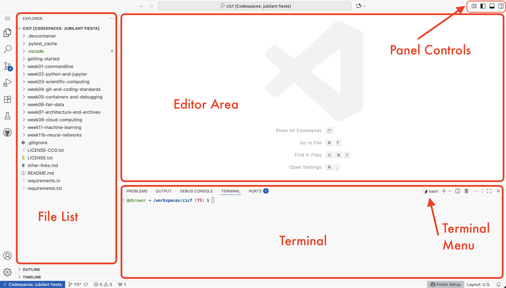

Getting Started
---------------

To provide a consistent environment for everyone, these tutorials use GitHub Codespaces
to provide a free, web-based virtual machine that has a command line.

1. If you don't have one already, sign up for a (free) GitHub account.
2. Start a codespace for this repository.

## Signing up for GitHub account

If you don't have a GitHub account create one at [GitHub](https://github.com/).
Accounts are free.

**Please send an email to <cicf@ci-compass.org> telling us your GitHub user name.**

<!-- save forking for week 4
## Fork this repository

Sign in to your account on GitHub and then visit this repository's page, [ci-compass/cicf](https://github.com/ci-compass/cicf).
Choose the "Fork" drop down on the upper right of the page, and then make a fork of the repository
into your own space, so the owner will be your account and keep the repository name `cicf`.
After some time you will have your own copy of the CICF repository.
-->

## Start a Codespace for this repository

Choose the big plus sign `+` along the top right of the screen and then "Create a new Codespace" from the dropdown menu.
Base the codespace on this repository (`ci-compass/cicf`),
on the `main` branch,
and use the default configuration, region, and machine type.
You may see a message that the "Codespace usage for this repository is paid for by ...".
Do not worry, the code space is free.
This message is just indicating that you are the owner of this Codespace.

After selecting "Create Codespace", a virtual machine is created and a new browser window should open.
The window provides a web-based interface to your codespace.
It should look similar to the following screenshot.

In the screenshot a few regions are marked in red.
There is a file pane, which lists the files in the virtual machine;
an editor pane where you can edit files (in the screenshot nothing is being edited, so nothing is displayed);
and at the bottom there is a prompt that should look similar to `@dbrower ➜ /workspaces/cicf (main) $`,
this is the terminal window.

You can make the terminal window larger by choosing the "full screen" button on the terminal pane.
You can also hide the file pane using the panel controls.

## Using the Codespace

The Codespace is persistent and will exist even if the browser window is closed.
One way to return to the codespace is to bookmark the URL for it.
You can also find the codespace again from your GitHub dashboard.
Sign in to GitHub and then from the hamburger menu in the top left corner choose "Codespaces" and then at the bottom of the page you will see a list of all your active Codespaces.
Choosing a Codespace in this list will then open a new browser window for it.

## Running Exercises

In each week there will be exercises named `exercise-1`, `exercise-2`, and so on.
The description of each exercise is in the file.
Do the task of the exercise and then you can see how you did by running the command `make`.
This will run tests and output the results to the terminal.
Successful tests appear as green, and unsuccessful tests appear as red.

