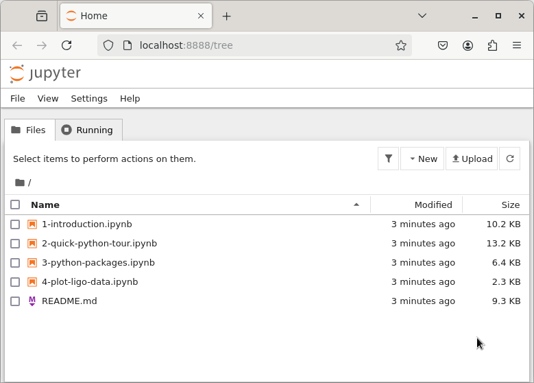

# CICF Week 3

The goals for week 3 lab are:

1. Install and use the Jupyter notebook application on your VM.
2. Be able to create, edit, and run notebooks.
3. Use the NumPy and MatPlotLib packages.
4. Download data from LIGO and know what an HDF5 file is.

Start your VM, launch a terminal, and be prepared to run a few
commands in that terminal.

## Update your copy of CICF repository

You should have done a `git clone` of the CICF repository in the home
directory of your VM in the first week itself.  In case you have not
done that yet, run this command:

```console
git clone https://github.com/ci-compass/cicf ~/cicf
```

Since we will keep updating the repository throughout the course, you
will have to make sure you have the latest changes in your local copy.
Change to `~/cicf` directory and then do a `git pull`:

```console
cd ~/cicf
git pull --autostash
```

## Install some software

We need to install some Debian packages on our VM using the [apt]
package manager.  But first, we needto run an `apt update` to update
package information from Debian's software repositories.  

```console
sudo apt update
```

Enter the password when prompted.

Once that is done, run the next command:

```console
sudo apt install python3-pip python3-venv wget
```

Type `Y` to confirm installation.

We will also need some additional Python packages. These we can
install using [pip], inside what is called a "virtual environment".
Create a virtual environment and activate it with these commands:

```console
python -m venv ~/venv
source ~/venv/bin/activate
```

If that worked, you should see a prompt like:

```console
(venv) cicf@debian: $
```

Now install the Python packages:

```console
pip install jupyter numpy scipy matplotlib h5py
```

[apt]: https://wiki.debian.org/AptCLI
[pip]: https://pip.pypa.io/en/stable/

If you are confused about the software we just installed, the below
table might help:

| package            | description                                                                  |
|:-------------------|:-----------------------------------------------------------------------------|
| [python3-pip][pip] | Python package installer                                                     |
| [python3-venv]     | Python module for working with virtual environments on Debian/Ubuntu systems |
| [wget]             | Command-line program used to download files                                  |
| [jupyter]          | An interactive computing environment                                         |
| [numpy]            | Python library for multidimensional arrays, matrices, etc.                   |
| [scipy]            | Python library for scientific computing                                      |
| [matplotlib]       | Python 2D plotting library                                                   |
| [h5py]             | Python library to work with [HDF5] data                                      |

[python3-venv]: https://packages.debian.org/bookworm/python3-venv
[wget]: https://www.gnu.org/software/wget/
[jupyter]: https://jupyter.org/
[numpy]: https://numpy.org/
[scipy]: https://scipy.org/
[matplotlib]: https://matplotlib.org/
[h5py]: https://www.h5py.org/

### A note about virtual environments

Virtual environments allow you to install Python packages in a
location that is isolated from the rest of the system.  This way, when
you install Debian packages written in Python using `apt`, they will
not conflict with the packages you installed using `pip` for your
projects.

Typically, for each of your Python projects, you will create its own
lightweight, isolated virtual environment, usually inside the project
directory.  And then you will install the packages each project need
in its own virtual environment.

(Although in this tutorial, you will note that you just set up a
virtual environment in your home directory. This should work just fine
for us, for now.)

You can figure out details eventually.  For now just bear in mind that
virtual environments are a solution to a problem that you are very
likely to encounter in the future. You can find a friendly explanation
[here](venv-realpython), and official documentation
[here](venv-pythonorg).

[venv-pythonorg]: https://docs.python.org/3/library/venv.html
[venv-realpython]: https://realpython.com/python-virtual-environments-a-primer/


## Run Jupyter

Go to `week02-python-and-jupyter` directory in your CICF repository
clone using `cd` command, and then start Jupyter:

```console
cd ~/cicf/week02-python-and-jupyter
jupyter notebook
```

A browser window will open, listing the contents of
`week02-python-and-jupyter` directory, where you will find some files
with `.ipynb` extension.  They are the Jupyter notebooks that we will
use this week.



Working through these notebooks is your task this week:

- [1-introduction.ipynb](./introduction.ipynb) is an introduction to
  Jupyter.
- [2-quick-python-tour.ipynb](./2-quick-python-tour.ipynb) is a quick
  introduction of Python programming language.
- [3-python-packages.ipynb](./3-python-packages.ipynb) is an overview
  of Python packages.
- [4-plot-ligo-data.ipynb](./4-plot-ligo-data.ipynb) is a notebook
  that will walk you through working with some science data in
  Jupyter.

You can open each these notebooks by double clicking them, or by
clicking on the "open" button that will appear when you select a
notebook.

### The third notebook: Python packages

The `math` library is part of the Python standard library.

It implements a routines to calculate few standard functions and some
basic probability distributions.

As noted in the lecture Python does not have an efficient built-in
array data type (rather, it approximates arrays by using lists and
nested lists).

The NumPy library implements an efficient array datatype, and is used
as a foundation for almost all scientific Python software.

```python
import numpy as np
```

The critical NumPy data type is the array.

"NumPy arrays are faster and more compact than Python lists. An array
consumes less memory and is convenient to use."
([source](https://numpy.org/doc/stable/user/absolute_beginners.html))
The one caveat with NumPy arrays is that all the elements inside an
array need to have the same data type (e.g. integer, float, double).

```python
a = np.array([[1,2,3,4], [5,6,7,8], [9,10,11,12]])
```

The `array()` function will turn nested lists into an array.
You can also make new arrays by asking for a zero array of a given size

```python
z = np.zeros(3)
z
```

or ones:

```python
m = np.ones((3,3))
```

(note that the dimensions are given as a _tuple_).
You can get the dimensions of an array with the `.shape()` method:

```python
m.shape()
z.shape()
```

You can also element-wise add, subtract, or multiply:

```python
z + 3
```

Or

```python
a % 2
```

Comparisons are element wise

```python
a > 5
```

### NumPy Linear Algebra

NumPy has routines to do basic linear algebra, such as finding a
matrix inverse, or solving a linear system.

```python
k = np.array([1,1,1], [1,1,0], [1,0,0])
k
```

Inverses

```python
from numpy.linalg import nl
kinv = nl.inv(k)
kinv
```

And matrix multiplication

```python
k @ kinv
```

Matrix visualization:

```python
import matplotlib.pyplot as plt
plt.matshow(a)
```

### The fourth notebook: working with LIGO data

In this part of the tutorial, let us plot some data from the LIGO observatory.  

#### Getting a LIGO dataset

Go to the the `week03` directory of your CICF repository clone, and
then run `wget` with the URL of the data set as its argument (as shown
below).

```console
cd ~/cicf/week03
wget https://gwosc.org/archive/data/S5/814743552/H-H2_LOSC_4_V1-815235072-4096.hdf5
```

That should download a file `H-H2_LOSC_4_V1-815235072-4096.hdf5`,
which is about 123MB in size.  This file is in a format called [HDF5],
commonly used to store scientific data.  We will use the Python h5py
package that we installed earlier to work with this file.

[HDF5]: https://en.wikipedia.org/wiki/Hierarchical_Data_Format

Open [4-plot-ligo-data.ipynb](./4-plot-ligo-data.ipynb) in your
Jupyter environment, and work through the notebook.


## Resources

Parts of this tutorial were taken from the [LIGO data tutorial](https://gwosc.org/tutorial02/).

- [Jupyter Manual](https://docs.jupyter.org/en/latest/)
- [Python Reference](https://docs.python.org/3/) for the most recent
  version of Python. (n.b. we are using an old verion, 3.9, on the
  VMs).
- [NumPy for Absolute
  Beginners](https://numpy.org/doc/stable/user/absolute_beginners.html)
- [MatPlotLib](https://matplotlib.org/)
- Literate Programming is a specific instance of the idea that code
  and documentation should be more mixed together. Here is a [Knuth
  paper](http://www.literateprogramming.com/knuthweb.pdf) and an
  [amazing website](http://www.literateprogramming.com/articles.html)
  (not Knuth's) with more information that you ever thought existed on
  program documentation.
- [HDF5](https://docs.hdfgroup.org/hdf5/v1_14/_intro_h_d_f5.html) is a
  file format that supports efficient storage and transfer of numeric
  data.
- [Markdown Cheat
  Sheet](https://github.com/adam-p/markdown-here/wiki/Markdown-Cheatsheet)
- The always useful Software Carpentry [Python
  course](https://swcarpentry.github.io/python-novice-inflammation/)
- All of the [released LIGO data](https://gwosc.org/data/)
