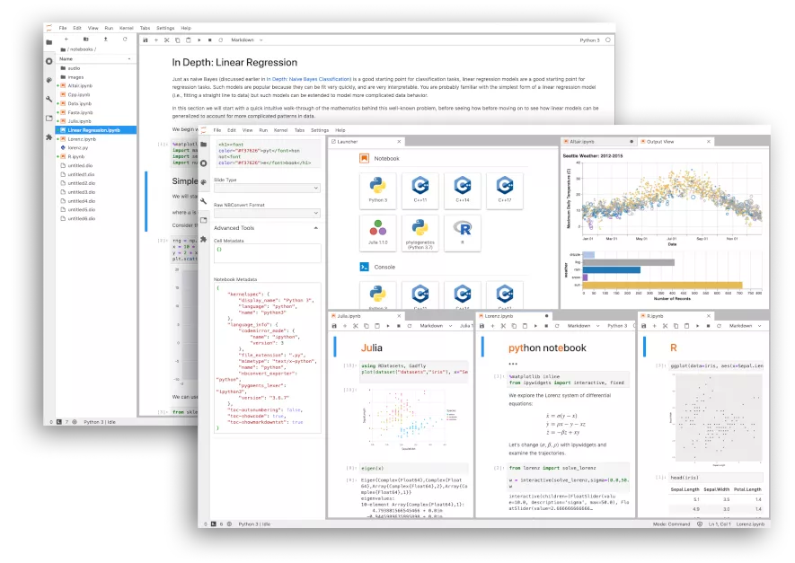
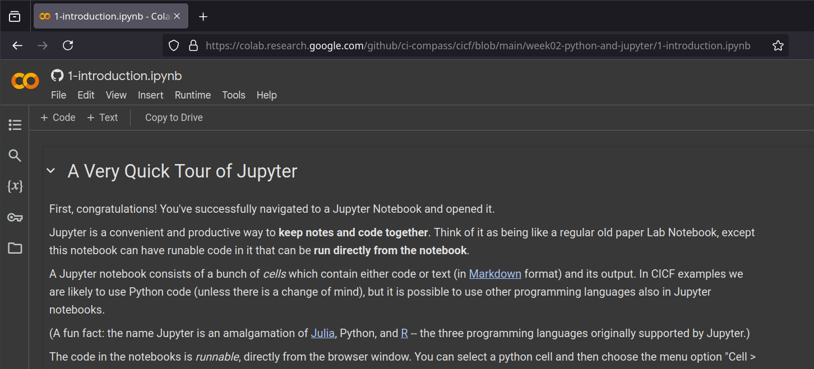
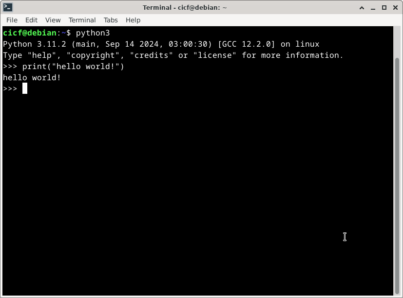
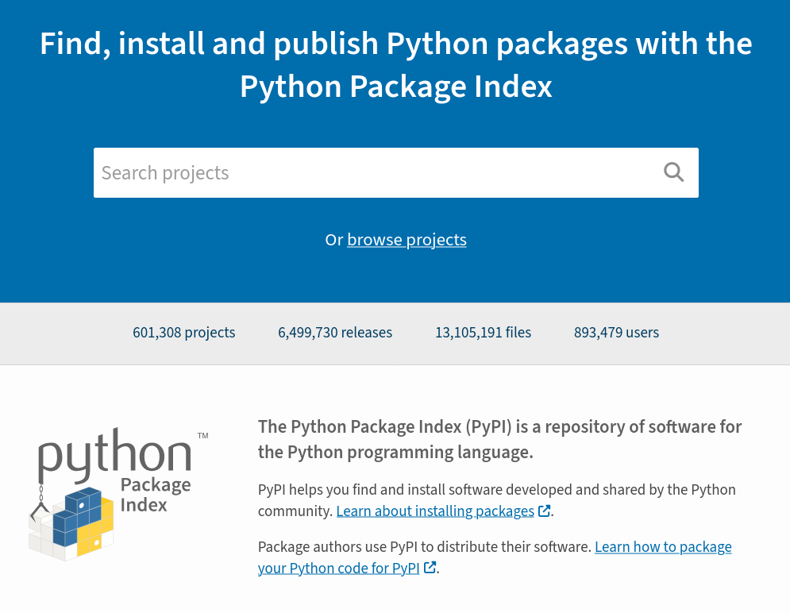
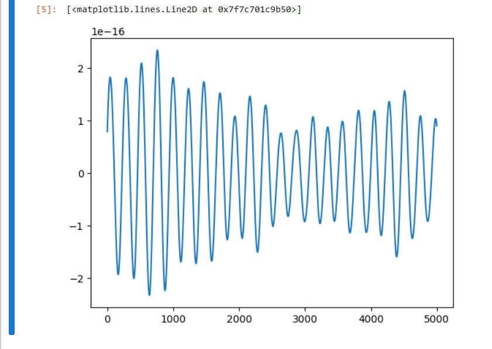

# Welcome to week two of CICF!

## The plan this week

We will work through four Jupyter notebooks in the tutorials this
week. 

::: {.notes}

The notebooks will give you:

- A quick tour of Jupyter notebooks.
- A quick tour of Python programming language.
- A quick overview of Python packages.
- A quick example of working with some LIGO data in Jupyter.

By necessity, we will keep things short and simple, and gloss over
some things.

:::

# Jupyter

## Jupyter notebooks

{width=50%}

::: {.notes}

What are Jupyter notebooks?  Why are they useful?

- Jupyter notebooks are a way to write text/documentation, code,
  equations, data, graphs, images, etc. together.
- You can view and edit these notebooks in a web browser window.
- You can execute code in these notebooks from the web browser window.
- You can share these notebooks with other people.

They are kind of like paper lab notebooks, but in a browser window.

:::

## JupyterLab

{width=50%}

::: {.notes}

- JupyterLab is a newer, fancier way of working with notebooks.
- Kind of like a web-based IDE (integrated development environment).
- You can work with multiple notebooks side by side, use a file
  browser, and use plugins that enhance functionality.
:::

## JupyterLab instances out there

{width=50%}

::: {.notes}

- Many organizations and projects host their own JupyterLab instances.

- [Google Colab](https://colab.research.google.com), [Microsoft
  Planetary Computer](https://planetarycomputer.microsoft.com/), [FABRIC
  project's JupyterLab instance](https://jupyter.fabric-testbed.net/),
  [Chameleon project's JupyterLab
  instance](https://jupyter.chameleoncloud.org/), etc.


- Google Colab is a fancier, dressed up rich cousin of JupyterLab.
  Your notebooks will work there.

- You can also set up an IDE (such as VS Code or Codium) to work with
  notebooks.
  
- You can preview notebooks from GitHub.com, sometimes.

- [GitHub Codespaces](https://github.com/codespaces) has support for
  notebooks.
:::

# Python

## First, a little preliminary

We will not learn all of Python this week.  Plenty of resources are
out there if/when you need them.

:::: {.columns}

::: {.column width="20%"}


:::

::: {.column width="20%"}


:::

::: {.column width="20%"}


:::

::: {.column width="20%"}


:::

::::

::: {.notes}

If you know any other programming language, you can learn Python on
your own very quickly.  Find a resource that suits your learning
style: books, tutorials, tutorial websites, videos, courses...

:::

## Trying out code


:::: {.columns}

::: {.column width="50%"}

Two quick ways:

- Jupyter notebooks
- REPL

:::

::: {.column width="50%"}



:::

::::

::: {.notes}

- You should try out the code examples on your own.

- Use a Jupyter notebook, write code in new cells, and run them.
- Use the Python REPL ("Read-Eval-Print Loop")
- Run `python3` in a terminal in your VM.
  - You (very likely) already have `python3` if you run macOS or
    Linux.
  - Windows? Install from Windows Store probably. I wouldn't know!

You can also write little scripts using an editor or IDE and run them.
REPL or notebook should be good enough to test things out.

:::


## Structure of a Python program

Python programs can be decomposed this way:

- Programs consist of modules.
- Modules contain statements.
- Statements contain expressions.
- Expressions create and process objects.

::: {.notes}
- We will discuss modules towards the end.

- Statements perform some action.
    - Example: `x = 42` (assignment), `import math` (an import
      statement)

- Expressions are pieces of code that evaluate to a value. Example:
    `42`, `x + y`, `x > y`, `"hello"`, etc.
:::

## Variables

- Variables give names to things.
- Variables are not strongly typed.

```python
>>> amount = 7
>>> amount
7
>>> amount = "a whole lot!"
>>> amount
a whole lot!
```

::: {.notes}
- Variables work the way you expect.

- Unlike Java or C++, the are not "strongly" typed.  A variable can be
a number one moment and then can suddenly become a string.

- You don't have to declare types of variables.

- Python is said to be dynamically typed.
:::

## Control flow statements

- You have `if`, `if`/`else`, `for`, `while`, etc.

- `pass` statement is a placeholder when you need to do nothing.
- `continue` statement will cause a jump to the top of the loop.
- `break` statement will cause an exit from the loop.

## Example

Here's a `for` loop inside of an `if` statement:

```python
if temperature >= 100:
    print("It boiled!")
    for sample_tube in range(1, 6):
        print("concentration is: ", tube_concentration[sample_tube])
else:
    print("Warmed up, but not boiling yet. Try harder.")
```
  
Notice colons at the ends of the `if`, `for`, and `else` statements.  

## Code layout has meaning

- Code blocks are indicated by indentation level.
  - In comparison C, C++ and Java begin blocks with `{` and end them
    with `}`.

::: {.notes}

- Indentation of a code block MUST be the same for the entire block. 
- Best Practice: indent with four spaces.
- Do not use tab characters unless you're certain that your editor
  will turn `<tab>` keys into spaces.

:::

## Basic data types

- Booleans (`True` and `False`)
- Numbers
  - Integers (example: `-1`, `0`, `1`, `2`, …)
  - Floating point numbers (example: `3.14`)
- Strings (example: `"hello world!"`)
- `None`

::: {.notes}

There are also:

- Complex numbers (example: `3+4j`)
- `Decimal()`, `Fraction()` types in the standard library.

:::

## Built-in data structures

- Lists 
- Dictionaries
- Tuples
- Sets

## Lists

```python
>>> temperatures = [44.2, 43.6, 107.9, "awfully hot!"]
>>> temperatures[3]
awfully hot!
```

::: {.notes}

Python lists are like arrays in C++ and Java, except:

- They can grow (and shrink) as needed.
- The different elements of an array don't all have to be the same
  type.

Lists are one-dimensional. If you would normally use a 2D array for
something, you would want to use a list of lists.

:::

## Another list example

```python
>>> grades = ["A", "B", "C", "D", "F"]
>>> len(grades)
5
>>> grades[0]
A
>>> grades[4]
F
>>> grades[5]
Traceback (most recent call last):
  File "<stdin>", line 1, in <module>
IndexError: list index out of range
```

::: {.notes}

Notice the first element in a list is numbered 0 (zero).  

Any time you index into a list, Python always counts starting at 0,
not 1. Forgetting this will likely be a big source of mistakes.

:::

## Strings

```python
>>> 'hello' == "hello"
True
>>> 'hello"
  File "<stdin>", line 1
    'hello"
    ^
SyntaxError: unterminated string literal (detected at line 1)
```

::: {.notes}

Strings can be surrounded by single quotes (`'`) or double quotes
(`"`). Whichever one you start a string with, you have to end with
that same kind.

:::

## Slicing strings and lists

```python
>>> st = "ABCDEFG"
>>> st[2:4]
CD
>>> st[4:]
EFG
>>> st[:2]
AB
>>> st[0:6:2]
'ACE'
```

- Slicing uses the syntax `object[start:end:step]`.
  - `step` is `1` by default.

::: {.notes}

Python strings _act_ just like lists of letters.  

Here's some useful syntax for selecting just parts of strings (and
lists).

This operation is called "slicing", and has the syntax
`object[start:end:step]`.

:::


## Dictionaries

```python
>>> drugs = { 
...    "asprin": 325, 
...    "acetaminophen": 500 
... }
>>> 
>>> drugs["asprin"]
325
>>> drugs["acetaminophen"]
500
>>> drugs["ibuprofen"]
Traceback (most recent call last):
  File "<stdin>", line 1, in <module>
KeyError: 'ibuprofen'
```

::: {.notes}

Dictionaries (or `dict` objects in Python parlance) contain pairs of
keys and values:

:::

## Tuples

```python
()               # An empty tuple.
(1,)             # A one-item tuple.
(0, 'Ni', 3.14)  # A four item tuple.
```

::: {.notes}

- Tuples construct groups of objects.
- Example:

:::

## Sets

```python
{1,2,3}
{0, 'Ni', 3.14}
```

::: {.notes}

- Sets are structures whose elements are unique.
- Example:

:::

## Operators

- All the usual ones:  `+`, `-`, `*`, `/`
- Integer division:   `7 // 2`   yields `3`
- Remainder:    `7 % 2`   yields `1`
- Exponentiation: `2 ** 8`  yields `256`

## Operator overloading

- Operators can have different meanings depending on the data type.

- The plus sign will concatenate strings: `"Hi there, " + 'human'`
yields the single string `"Hi there, human"`.

## Functions

```python
import math  # use Python's math module.

def area_of_circle(radius):
    """
    Compute area of a circle.

    :param radius: radius of the circle.
    """
    result = math.pi * radius ** 2
    return result
```

```python
>>> area_of_circle(10)
314.1592653589793
>>> area_of_circle(5)
78.53981633974483
```

::: {.notes}

- Lots of built-in functions: `print()`, `range()`, ...

- Easy to create your own.

- We have also sneakily introduced usage of modules and comment syntax
here!

:::


## User defined classes

```python
class Customer:
    def __init__(self, name, address):
        self.name = name
        self.address = address

    def show(self):
        print(self.name + " lives at " + self.address)
```

```python
>>> c = Customer("Bob", "1234 Wooded Way")
>>> c.show()
Bob lives at 1234 Wooded Way
```

::: {.notes}

Python classes can't be too strange to those familiar with C++ or
Java.

:::


## Error handling with exceptions

```python
try:
  individual_portion = total_grams / number_of_people
except:
  print("Number of people was zero, no valid answer!")
```

::: {.notes}

- When an unrecoverable error occurs, the Python runtime "throws" an
exception that is "caught" by an exception handler.

- If you do not catch an exception, your program will fail with an
error message.

:::

## Modules

Modules are Python's _organizational units_.

```
mypackage/
    __init__.py
    module1.py
    module2.py
    subpackage/
        __init__.py
        submodule1.py
```

::: {.notes}

- Modules are _organizational units_ of a Python program.  When you
create a Python project, you would split your code into logical units,
called _modules_.

- In concrete terms, modules correspond to files.

:::

## Using modules

```python
from mypackage import module1
from mypackage.subpackage import submodule2 as sm2

module1.some_function()
sm2.some_other_function()
```

```python
import mypackage

mypackage.module1.some_function()
mypackage.subpackage.submodule1.some_other_function()
```

::: {.notes}

- You would use a module in another module like in the example.
- These methods are roughly equivalent.

:::

# Python packages

## What are packages?

Packages are the way to distribute Python software.

::: {.notes}

- Packages are the way to distribute Python software.
- Packages can contain libraries (example: NumPy, SciPy...) or
  applications (example: Jupyter). Or sometimes both.
- Packages are a collection of modules.
- You can install packages, and use in your projects.

:::

## An example package: NumPy

Install NumPy like so:

```
pip install numpy
```

And then use it like so:

```python
>>> import numpy as np
>>> rng = np.random.default_rng()
>>> samples = rng.normal(size=2500)
>>> samples
array([ 1.61380659,  1.21211191, -0.30766142, ...,  1.77788338,
       -3.08686752, -0.20901042])
```

::: {.notes}

The example of generating normally distributed random numbers is from
<https://numpy.org/>.

:::

## Python Package Index (PyPI)



::: {.notes}

- People publish Python packages at PyPI.

- For most common needs with Python, there's a really good chance
  someone already has created a solution and published it in Python
  Package Index, also known as PyPI (<https://pypi.org/>).

- PyPI is a large repository of Python packages.
  - "601,286 projects; 6,499,014 releases; 13,103,667 files; 893,449
     users" at the time of writing this.  That is huge!

:::

## pip

- `pip` is the Python package installer.
- `pip` is on PyPI: <https://pypi.org/project/pip/>.

::: {.notes}

- `pip` is a command-line tool used to install Python packages from
  PyPI.
  - (Also from other Python repositories, sometimes.)
- `pip` itself is on PyPI: <https://pypi.org/project/pip/>
  - so you can `pip install --upgrade pip` when there are new `pip`
    releases on PyPI.

:::

## Anaconda and `conda`


::: {.notes}

- Anaconda (<https://www.anaconda.com/>) is a "Python distribution".
- It is a curated collection of Python software, popular in science,
  AI, and data science communities.
- `conda` is Anaconda's package manager.
- `conda` is Anaconda's alternative to `pip`.
- Conda handles package management and dependency resolution better
than pip.

:::

# Working with LIGO data

## Plotting LIGO data



::: {.notes}

- LIGO (<https://www.ligo.caltech.edu/>) is an NSF major facility that
  studies gravitational waves.
  
- LIGO makes experimental data available for the public.

- One of your tasks this week is to download some of this data, and
  plot it in a Jupyter notebook.

:::


# FIN
