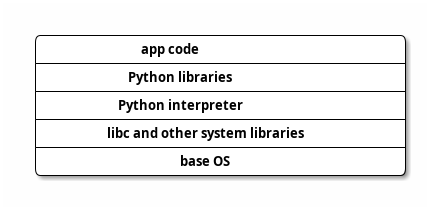
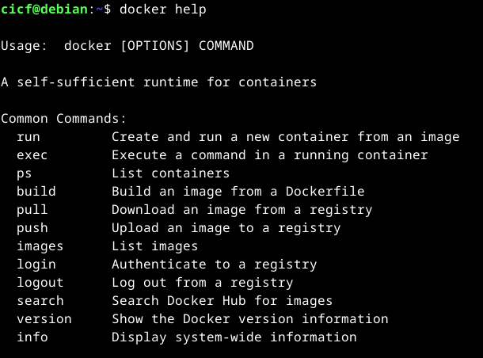

# Welcome to week five of CICF!

## The plan this week

We will go over two different topics: containers and debugging

::: {.notes}

They are different topics. There could be some unifying thing there,
such as debugging containers or debugging inside containers, but we
are not there yet.  We are discussing them together only because we
could not dedicate more time to each of them. They are both important
topics.

By necessity, we will keep things short and simple, and gloss over
some things.  You should explore things on your own, and go after
things that really interest you.

:::

# Containers

## What are containers?

Containers are lightweight and portable environments that package an
application and its dependencies.

- Docker is the most popular implementation.
- Others exist too, such as:

  - Podman, Apptainer (formerly Singularity), LXC/LXD, CoreOS rkt (or
    "Rocket"), Kubernetes cri-o

Let us just stay with Docker here.

::: {.notes}

Containers enable consistent deployment across different computing
platforms.  If your application was built and tested on some old
Debian stable version, you would be able to "containerize" it, and run
it on a new Ubuntu machine, or even macOS or Windows hosts -- as long
as you have a working container runtime on the target machine.

We will look at docker here, but the fundamentals are the same.

:::


## Why would you use containers?

- Building software can be a brittle process.
- So can be deploying software.

Problem is having the correct versions of all the dependencies.

So we _package_ software and dependencies into _containers_.

::: {.notes}

Building and deploying software can be a brittle process.

You have some software x that is at version 1, and it needs version 1
of library y.  But your computer has only version 0.9.8 of library y.
If you try to upgrade library y, another application z which depends
on y 0.9.8 might break.

This gets even more complicated when you are deploying software on a
fleet of computers.  Sometimes multiple people or teams ("developers"
who write the software on their machines and "operations" who run the
software on "production" machines) are involved, and there may be a
mismatch between developer environment and production environment.

When operations team complain to the developer when something does not
work, the developer would say: "it works on my machine!"

We solve this problem by "containerizing" x and its dependencies.

Containers allow us to package our applications, the runtime required
to run the application, configuration files, and any dependencies the
application needs into one artifact.

As long as there is a container runtime in the target machine, the
application works.

The host OS on the target machine could be Ubuntu 25.04, and the
container could be made using some old version of Debian stable.
Since we have "containerized the application", it will seamlessly
work.

:::

## Container images




<!-- ``` -->
<!-- +------------------------------------+ -->
<!-- | app code                           | -->
<!-- +------------------------------------+ -->
<!-- | Python libraries                   | -->
<!-- +------------------------------------+ -->
<!-- | Python interpreter                 | -->
<!-- +------------------------------------+ -->
<!-- | libc and other system libraries    | -->
<!-- +------------------------------------+ -->
<!-- | base OS                            | -->
<!-- +------------------------------------+ -->
<!-- ``` -->

::: {.notes}

Container images are "tarballs", or compressed archives of a
filesystem tree.

Container images are built "layer by layer".  Each block in the
diagram can be thought of as a layer, although that is not strictly
true.

A layer is basically a directory tree.  Each of the layers have an id.
The id is a sha256 hash of the layer's contents.

If a file is in two layers, you will see the version from the top
later.

By default, when you write in a container, they will go into a
temporary layer.  They will be gone when the container exits.

If you want to keep your changes, you will need to mount a directory
that is outside of the container, and write to that mounted directory.

(Look around `/var/lib/docker` maybe.)

:::


## A quick look at `docker` commands




<!-- ``` -->
<!-- $ docker help -->

<!-- Usage:  docker [OPTIONS] COMMAND -->

<!-- A self-sufficient runtime for containers -->

<!-- Common Commands: -->
<!--   run         Create and run a new container from an image -->
<!--   exec        Execute a command in a running container -->
<!--   ps          List containers -->
<!--   build       Build an image from a Dockerfile -->
<!--   pull        Download an image from a registry -->
<!--   push        Upload an image to a registry -->
<!--   images      List images -->
<!--   login       Authenticate to a registry -->
<!--   logout      Log out from a registry -->
<!--   search      Search Docker Hub for images -->
<!--   version     Show the Docker version information -->
<!--   info        Display system-wide information -->

<!-- [...] -->
<!-- ``` -->

::: {.notes}

If you run `docker help`, it will print a longish message, with some
hints about subcommands.  We will look at some of the commonly used
subcommands.

This might look confusing at first.  It was confusing to me at first
when I was trying to figure out containers!

Together let us try to demystify this.

:::

## What is a `Dockerfile`?

```Dockerfile
# Base image with Python 3.12
FROM python:3.12

# Set working directory in container
WORKDIR /app

# Copy all project files to container
COPY . .
RUN pip install .

# Container listens on port 5000
EXPOSE 5000

# Command to run the application
CMD ["python", "app.py"]
```

::: {.notes}

A Dockerfile is a text file that contains instructions about how to
build a docker image. When you run `docker build`, it will use the
instructions from a Dockerfile.

In the Dockerfile, you will specify:

- a base image
- environment setup
- installation steps
- network ports to expose
- start-up commands to run when you run the container
- and possibly other things.

:::


## What do you do with a `Dockerfile`?

You can build container images! You can run them!

```
docker build --tag "app:latest" .
docker images
docker run app:latest
```

In the tutorial we will use a simpler `Dockerfile` and slightly
different options with `docker build`, but you get the idea.


## Containers under the hood

They use some Linux specific techniques:

- _cgroups_ (or "control groups") to set resource limits (such as
  memory and CPU).
- _pivot_root_ to change the root filesystem.
- _namespaces_ to allow processes to have their own network, process
  IDs, hostname, mounts, users, etc.
- _capabilities_ to give specific permissions.
- _seccomp-bpf_ to prevent dangerous system calls.
- _overlay filesystems_ to make container image layers work.

## Container registries

What happens when you do a `docker pull`?

::: {.notes}

- Remember that we used the Python base image in the example.  It was
  published by the Python Software Foundation in a container registry,
  called Docker Hub.

- Sharing container images is useful.  You help others to run your
  software.  So you publish your images in a registry such as Docker
  Hub.

- Docker Hub is a public registry.  There are others too, like
  GitHub's container registry.

- Some organizations run private registries.  My organization,
  Renaissance Computing Institute, runs a private registry.

- In order to publish, you log in to the registry with `docker login`,
  and publish your image with `docker push`.

- The images have version numbers. When you pull an image, by default,
  you will be pulling the latest version.  You can always specify a
  version if you want a different version.

:::


## A word about versioning

You could use:

- a number
- a date or a timestamp
- a commit hash
- a version string like `major.minor.patch`

See <https://semver.org/> and [Python version
specifiers](https://packaging.python.org/en/latest/specifications/version-specifiers/).

::: {.notes}

You work and work and work on your software project. From time to
time, you will release your project.  The releases will have some
version number.  Versions indicate what features and bugs are present
in a release.

There are several ways of versioning software projects.

When working alone on a project that only you use, versioning scheme
does not matter too much.

When working in a team, or when working on a project that has public
releases, it is a good idea to use a more formal scheme such as
semantic versioning.

:::


## Containers and virtual machines

You can run a container inside a virtual machine but can you run a
virtual machine inside a container?


# Debugging

## What is a bug?

<!-- TODO: Grace hopper and the bug -->


::: {.notes}

Grace Hopper was a computer scientist and a US navy rear
admiral.

While working on a working on a Mark II Computer at Harvard University
in 1947, Hopper's team found a moth that was stuck in a relay and that
was causing the computer to malfunction.

They attached the moth to the log sheet for that day with the note,
"first actual case of bug being found".

(Remember that transistores were invented in 1947. In the early days
before transistors, computers were electro-mechanical devices.)

Although they did not mention the exact phrase "debugging" in these
logs, this is a a first known instance of "debugging" a computer.  For
many decades, the term "bug" for a malfunction had been in use in
several fields before being applied to computers.

The log book with the moth can be found at the Smithsonian
Institution's National Museum of American History in Washington, D.C.

:::


## Debugging strategies

- Often the problem is the mismatch between our mental models (about
how things are supposed to work) and reality (how things actually
work).

- When debugging, we're trying to correct our mental models.


## Use print statements

Add `print()` statements at various points in your code, to understand
the flow of execution.

## Read the logs

- Programs (sometimes) write logs.
  - Python has a `logging` module.
- The OS keeps many logs.
  - Take a look at `/var/log`.

## Use a debugger

- Python has a `pdb` module.
- Your IDE (VS Code, PyCharm) may have a debugger built-in.
- JupyterLab has a debugger.


## Use a trace facility

Python has a `trace` module.

```
python3 -m trace --trace hello.py
```

## Write some tests

- Writing a test is a good idea.
- It is much easier to debug code when you have tests.


## Talk to a friend

- Get a friend or colleague to review your code.
- Explain your code to the said friend or colleague.
- If no one is available, talk to a rubber duck!
  - This technique is called "rubber duck debugging", or simply
    "rubberducking".
  - <https://en.wikipedia.org/wiki/Rubber_duck_debugging>

# FIN
