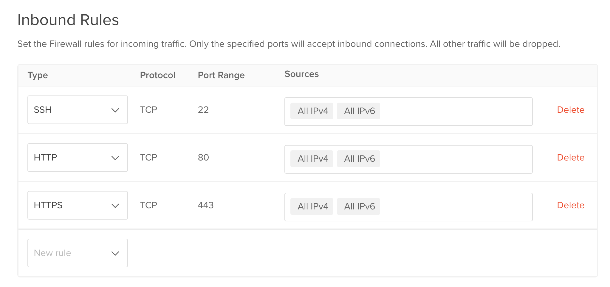

# CICF Week 8

The goal for this week's tutorial are:

- Familiarize yourself with a virtual machine running in a cloud
  environment.

We will:

- Log into a cloud virtual machine (VM) using `ssh`,
- Copy some files to the VM using `scp`,
- Run JupyterLab in the VM, access it over the internet, and
- Learn how to somewhat secure the VM with a firewall.

## Tutorial

### Update your CICF repository clone

Start a terminal in the CICF VM running on your desktop, and run these
commands:

```
$ cd ~/cicf/week08-cloud-computing
$ git pull origin main
```

### Use `ssh` to connect to your cloud VM

Each of you will get your own VM. The virtual machines are deployed
for you on Digital Ocean (DO), a cloud provider.

(DO calls their VMs "droplets", but that should not really matter to
us. Our goal is to make ourselves familiar with cloud computing in
general, not any one vendor's tools and terminology.)

You can access your VM using [`ssh`][ssh], the OpenSSH remote login
client.  The account name on the VM is `cicf`.  We will not use a
password to log on to the VM, but rather, we would use public key
authentication.  In fact, password authentication with `ssh` is
disabled on these VMs, because it is considered insecure.  Remember
that our little VM is out there on the hostile territory of the public
internet, and bad people can guess or brute-force passwords.  Using
public key cryptography is more secure.

[ssh]: https://www.openssh.com/

You would log on to your VM with:

```
$ ssh -o PasswordAuthentication=no -o PubkeyAuthentication=yes -i ~/.ssh/id_ed25519 cicf@YOUR-FIRST-NAME.cicf.cloud
```

But wait! Since the above `ssh` command is long and annoying to type
every time we need to use `ssh` (and its sibling `scp`, which we will
use next), our first order of business should be saving those options
in `~/.ssh/config`.  Copy these lines to your `~/.ssh/config`:

```
Host *.cicf.cloud
    User cicf
    PubkeyAuthentication yes
    PasswordAuthentication no
    IdentityFile ~/.ssh/id_ed25519
```

With that configuration, you should be able to simply do:

```
ssh YOUR-FIRST-NAME.cicf.cloud`.
```

Replace `YOUR-FIRST-NAME` with, well, your first name.  For reference,
these are the virtual machines:

* ~~`aidan.cicf.cloud`~~
* `anshuraj.cicf.cloud`
* `baydan.cicf.cloud`
* `catherine.cicf.cloud`
* `dylan.cicf.cloud`
* `ejay.cicf.cloud`
* `elikem.cicf.cloud`
* `emma.cicf.cloud`
* `jasmine.cicf.cloud`
* `joanna.cicf.cloud`
* `macy.cicf.cloud`
* `naomi.cicf.cloud`
* ~~`noe.cicf.cloud`~~
* `priscilla.cicf.cloud`
* ~~`rishi.cicf.cloud`~~
* `spoorthi.cicf.cloud`
* `tamara.cicf.cloud`
* `xiuweb.cicf.cloud`

If your name is struck out, that is because you did not get your
public key to us on time.  You can twiddle your thumbs now, or get
cracking to get those keys to us at least now!

When you attempt to connect to your VM for the first time, `ssh` will
print a warning like this:

```
The authenticity of host 'sajith.cicf.cloud (123.44.55.666)' can't be established.
ED25519 key fingerprint is SHA256:rkTNpgELv73iqzC/duiuwF/F2/Af8tEee4y9yer78lc.
This key is not known by any other names.
Are you sure you want to continue connecting (yes/no/[fingerprint])?
```

You could safely respond with a `yes` here.

This is what just happened: When you connect to an SSH server for the
first time, the server presents its public key fingerprint.  (Just
like you have a key, the server also has a key.)  Since the client
(your `ssh` program) has no prior knowledge of this server, so it
prompts you with a message the above.  On future connections, the
client compares the server’s presented public key with the one stored
in `~/.ssh/known_hosts`.  If they match, the connection proceeds.

What if they do not match?  In that case `ssh` will print a warning
like:

```
WARNING: REMOTE HOST IDENTIFICATION HAS CHANGED!
IT IS POSSIBLE THAT SOMEONE IS DOING SOMETHING NASTY!
```

That means that the server's key changed.  Either the server was
re-installed (or re-provisioned), or someone is pretending to be your
server.

This model of trusting the server at first connection is known as TOFU
(or Trust On First Use).  TOFU operates under the assumption that the
first connection was secure (meaning, no attacker was present).  Any
future changes in the server's fingerprint is suspicious.

Once you will log on, check out `~/.ssh/authorized_keys` in the cloud
VM.  That is where we stored your public key.  The VM let you log in
because you have the private key corresponding to this public key.
There's a little bit of a _handshake_ going on between the ssh server
(`sshd`) and client (your `ssh` command) to determine that you really
have the private key.  If you want to know more, read
[this][understand-ssh] article.

<!-- Understanding the SSH Encryption and Connection Process -->
[understand-ssh]: https://www.digitalocean.com/community/tutorials/understanding-the-ssh-encryption-and-connection-process

Another thing to note: the cloud VM is almost just like the VM you are
running on your desktop.  It is running Debian 12.  Try running the
below command both on the desktop VM and the cloud VM:

```
$ cat /etc/os-release
```

If you run `uname -a`, it will produce slightly different output,
because some details are different.  The point is, it is the same OS
that you have been using: you are using the same `bash` shell, and you
have access to commands like `sudo` and `apt`.

You just do not have full desktop access to your VM, because using
`ssh` and command-line over the network is faster and more efficient.


### Copy some files to your cloud VM

We have six files in [`data`](./data) directory:

- [`install-docker.sh`](./data/install-docker.sh), our old friend from
  week 5. We will use this script to install Docker on the VM.
- [`compose.yml`](./data/compose.yml), a Docker compose file that we
  will use to deploy JupyterLab and [Caddy], a [reverse proxy] server.
- [`Caddyfile`](./data/Caddyfile), which contains necessary
  configuration for Caddy.
- [`jupyter-caddy.service`](./data/jupyter-caddy.service), a "unit"
  file that we will use to run Jupyter and Caddy using Docker Compose
  as a background service.
- An [`.env`](./data/.env) file, where we will add some configuration
  for Caddy.
- [`plot-ligo-data.ipynb`](./data/plot-ligo-data.ipynb), the notebook
  from week 2, but with some modifications.

 [Caddy]: https://caddyserver.com/
 [reverse proxy]: https://en.wikipedia.org/wiki/Reverse_proxy

We will use [`scp`][scp] to copy the `data` directory from your local
VM to the cloud VM:

```
$ scp -r data YOUR-FIRST-NAME.cicf.cloud:
```

[scp]: https://en.wikipedia.org/wiki/Secure_copy_protocol

Since this is a directory that we are copying, we use the `-r`
(recursive) flag here.  For copying just one file, we do not need to
use the `-r` flag.

Note that the above is a short-cut for the longer command below.
Since `ssh` and `scp` are part of the same suite of tools, they use
the same configuration file, so we get to type less.  It also helps
that the home directory on the remote host is the default destination
when you invoke `scp`.

```
$ scp -o PasswordAuthentication=no -o PubkeyAuthentication=yes -i ~/.ssh/id_ed25519  -r data cicf@YOUR-FIRST-NAME.cicf.cloud:/home/cicf/
```

### Install Docker on the cloud VM

In the cloud VM, run:

```
$ cd ~/data
$ ./install-docker.sh
```

Press `y` when prompted.

Once Docker has been installed, add yourself to `docker` group:

```
$ sudo usermod -a -G docker $USER
```

Log out of the VM using `Control-D`, `exit`, or `logout`, and log back
in with `ssh`:

```
$ ssh YOUR-FIRST-NAME.cicf.cloud
```

Make sure that you are now indeed in `docker` group:

```
$ groups
cicf sudo docker
```

### Run JupyterLab and Caddy with Docker Compose

Docker Compse is a tool for running applications running in more than
one container together.  You would run Docker Compose in the format
`docker compose COMMAND`.  Take a look at the output of `docker
compose help` to get an idea of what you can do.

You specify the applications you need to run with Compose and their
configuration in a file named `compose.yml` or `docker-compose.yml`.
Our `compose.yml` is in `~/data` directory:

```
$ cd data
```

We already have the configuration to run JupyterLab and Caddy in this
`compose.yml`.  It needs some additional information, which we provide
in the form of environment variables.  Instead of setting shell
environment variables, we can set them in an `.env` file, and `docker
compose` will pick them up.

Open `.env` in an editor (`nano` perhaps).  It contains three lines in
the form `KEY='VALUE'`, and some lines of comments.  Update values
corresponding to these three keys:

- `DOMAIN`.  You should use your VM's actual domain name (or FQDN, or
  Fully Qualified Domain Name) here.  You can find it in the list of
  VMs above, or by running the command `hostname -f`.
- `CADDY_USERNAME`.  The default is `cicf`, and it should be fine.
  You can change this to something else if you want to.
- `CADDY_PASSWORD`.  Caddy insists that the password **must be**
  hashed.  Meaning, we can't use a plain readable value here.  The
  password must be scrambled using a hash algorithm.  In order to hash
  a password, we can use the command:
  
```
$ docker run caddy:latest caddy hash-password -p '<YOUR-PASSWORD>'
```

Replace `<YOUR-PASSWORD>` with your password, run the command, and
copy the result to the right place in the `.env` file.

For reference, here's my `.env` file without any comments (the lines
that start with `#` are comments):

```
DOMAIN='sajith.cicf.cloud'
CADDY_USERNAME='cicf'
CADDY_PASSWORD='$2a$14$P5QEsGpvgJ79Ie8vAsRN1uGDKecpD6/H5QlPK6IFsGaVMYp53q1Du'
```

(My initial plan was to run JupyterLab in an "open" mode, without
setting up any authentication, but I quickly learned my lesson.
Someone uploaded a cryptocurrency miner to my test JupyterLab instance
and ran it there.  The miner used 100% CPU, thus making my VM became
unresponsive. Oops.)

Now we can run Docker Compse in detached mode (as in, not attached to
a terminal), with:

```
$ docker compose up -d
```

This will run JupyterLab and Caddy. JupyterLab will run on port 8888,
but we will not expose that port to the internet.  We will expose
ports 80 and 443 of Caddy to the internet.  Port 80 is for HTTP
(un-encrypted web traffic) and 443 is for HTTPS (encrypted web
traffic).  All port 80 traffic will be re-routed to
port 443.

For HTTPS to work correctly, Caddy will need a [Transport Layer
Security (TLS)][TLS] certificate.  This certificate will basically
assert that the domain is what it claims it is, and provide the
information necessary for encryption and data integrity.

[TLS]: https://en.wikipedia.org/wiki/Transport_Layer_Security

Most websites these days use TLS.  When you visit them with a web
browser, you will see a padlock by the address bar, indicating that
the connection is secure.  If we do not present a "good" certificate
that the web browser honors, the browser will issue a warning message.

Caddy can seamlessly get a valid TLS certificate from [Lets
Encrypt][le], a non-profit certificate authority.

[le]: https://letsencrypt.org/

Getting a TLS certificate used to be quite an involved process.  You
had to pay for your certificates, and go through some manual processes
to prove your identity.  Let's Encrypt is a wonderful project that
removed this friction and made encrypted communication accessible to
everyone.

Anyway, end of speech.  We can now test things by visiting our new
site at `https://YOUR-FIRST-NAME.cicf.cloud` with a web browser.  The
browser should present a dialog box, where you must enter the username
and password that you configured in the previous step.

Watch the logs that `docker compose` prints on the console when you
started things up and when you visited the site:

```
$ docker compose logs --follow
```

Use `Control-C` to stop following the log.

You can shut down things with:

```
$ docker compose down
```


### Use object storage

In week 2, we opened a LIGO data file in a Jupyter notebook, and made
a plot from the data contained in the file.  I have uploaded the same
HDF5 file to a [DigitalOcean Spaces][do-spaces] object store, and
modified the notebook such that it reads the file from the object
store.

[do-spaces]: https://www.digitalocean.com/products/spaces

The notebook should be available at the address
`https://YOUR-FIRST-NAME.cicf.cloud/lab/tree/work/plot-ligo-data.ipynb`.
Run the code in the notebook, and see if you can produce the same plot
from week 2.

DigitalOcean Spaces is an object store compatible with [Amazon Simple
Storage Service (AWS S3)][aws-s3].  Many storage systems, including DO
S3, provide [an API][aws-s3-api] that is compatible with S3, so we can
use the same tools and libraries that work with S3 against these other
S3-compatible systems also.

[aws-s3]: https://aws.amazon.com/s3/
[aws-s3-api]: https://docs.aws.amazon.com/AmazonS3/latest/API/Welcome.html

I created a bucket in DO Spaces, uploaded the file in the bucket, and
made it readable for everyone without having to use an ID and secret.
I avoided using a secret to keep this tutorial simple, but in "real"
settings you may want to use a secret.

I used the tool [`s3cmd`][s3cmd] to all this.

```
$ s3cmd mb s3://cicf-bucket
$ s3cmd put ../../week02-python-and-jupyter/H-H2_LOSC_4_V1-815235072-4096.hdf5 s3://cicf-object-store 
$ s3cmd setacl s3://cicf-object-store/H-H2_LOSC_4_V1-815235072-4096.hdf5 --acl-public
```

[s3cmd]: https://s3tools.org/s3cmd

Before doing all that, I needed to configure `s3cmd` to work with DO
Spaces.  Documentation for using s3cmd with DO is [here][do-s3cmd],
and you can find some documentation about using `s3cmd` with DO
[here][do-s3cmd-usage].

[do-s3cmd]: https://docs.digitalocean.com/products/spaces/reference/s3cmd/
[do-s3cmd-usage]: https://docs.digitalocean.com/products/spaces/reference/s3cmd-usage/


### Install a service

The `docker compose` service you ran will quit when you log out of
your `ssh` session, because that is how processes work.

To make things continue running even when you are logged out of the
cloud VM, we can install a [systemd] service.

[systemd]: https://systemd.io/

Copy `jupyter-caddy.service` to the correct location:

```
$ sudo cp jupyter-caddy.service /etc/systemd/system
```

Enable the service now:

```
$ sudo systemctl enable --now jupyter-caddy.service
```

We can check the status of the service using:

```
$ systemctl status jupyter-caddy.service
```

Or:

```
$ journalctl -xeu jupyter-caddy.service
```

We can make sure that things are running with:

```
$ docker compose ps
```

And follow the logs with

```
$ docker compose logs --follow
```

### Enable some firewall rules

Bad actors will keep trying to take over computers on the internet, so
that they can run botnets, bitcoin mining operations, spam networks,
or some such.  Since the internet can be a hostile place, we should
expose only the necessary network ports to the world.

We could use the program [nmap] to run a quick scan against our VM:

[nmap]: https://nmap.org/

```
$ nmap sajith.cicf.cloud
Starting Nmap 7.93 ( https://nmap.org ) at 2025-03-02 21:20 CST
Nmap scan report for sajith.cicf.cloud (134.209.35.136)
Host is up (0.066s latency).
Other addresses for sajith.cicf.cloud (not scanned): 2604:a880:800:14::baf9:2000
Not shown: 991 closed tcp ports (conn-refused)
PORT     STATE    SERVICE
22/tcp   open     ssh
25/tcp   filtered smtp
80/tcp   open     http
111/tcp  filtered rpcbind
135/tcp  filtered msrpc
139/tcp  filtered netbios-ssn
443/tcp  open     https
445/tcp  filtered microsoft-ds
8888/tcp open     sun-answerbook
```

Those is a lot more open ports than necessary.  Some of them are
default services run by the operating system, but we do not want them
exposed to the internet.

We only want to expose the ports 22 (SSH), 80 (HTTP), and 443 (HTTPS).
The way to do this is by using a firewall.  We will use [ufw] (short
for "The Uncomplicated Firewall") to set up some firewall rules.

[ufw]: https://wiki.ubuntu.com/UncomplicatedFirewall

Install ufw:

```
$ sudo apt update
$ sudo apt install -y ufw
```

And now add the rules:

```
$ sudo ufw allow 22/tcp
$ sudo ufw allow 80/tcp
$ sudo ufw allow 443/tcp
$ sudo ufw default deny incoming
$ sudo ufw default allow outgoing
```

Now we need to "enable" `ufw`, so that the above rules take effect,
and `ufw` will run when you reboot the VM:

```
$ sudo ufw enable
```

Hit `y` when prompted.  If we run `nmap` scan again now, we should see
the desired output.

You can also check the status of the firewall with:

```
$ sudo ufw status verbose
```

Now, note that the cloud provider also might provide some firewall
features.  Below is a screenshot from Digital Ocean's console, for
example.



Since this tutorial aims to be vendor neutral, we used `ufw`.  There
are instances where the cloud vendor's firewall is preferable, such as
when you apply firewall rules to a set of VMs.  Also, the vendor's
firewall rules are deployed at the network's "edge".  Meaning, the
traffic you block with vendor tools does not even reach your VM.


### Monitoring the VM

Once your VM is online, you most certainly want to keep an eye on
it.  You want to know when something goes wrong, and you want to fix
whatever it is that has gone wrong.  You would use monitoring tools
for this.

In the basic case, we can use a simple monitoring tool like [monit] to
watch system status, and raise alerts or restart the programs that go
hay-wire.  We can also use the cloud vendor's console to check on some
basic things such as network traffic, CPU usage, and disk I/O.  Here
is a screenshot of a VM's network traffic graph as reported by
DigitalOcean console:


As we get more serious, we will want to monitor more things. Here is a
non-exhaustive list of things we could be monitoring:

- **System resources**, such as CPU, memory, disk, and network usage.
- **Server health and availability status**, such as
  uptime/availability, status of critical processes, hardware health.
- **Application and service performance status**, such as response
  time/latency, error rates, and throughput.
- **Storage and databases status**, such as database performance, and
  file system events.
- **Security status**, such as login attempts, firewall and network
  security, and system logs.
- **Network and connectivity status**, such as DNS resolution and
  availability of external service dependencies.
- **Application metrics**, such as app-specific performance metrics
  (example: order processing rate in an e-commerce site), and status
  of task queues.
- **Environmental factors**, such as power and server room conditions
  (temperature and humidity via sensors).

Here is a list of some popular server monitoring tools:

| Tool         | Type        | Best For                 |
|--------------|-------------|--------------------------|
| [Prometheus] | Open-source | Cloud-native, Kubernetes |
| [Nagios]     | Open-source | Traditional IT           |
| [Zabbix]     | Open-source | Enterprise networks      |
| [Datadog]    | Proprietary | Hybrid cloud, APM        |
| [New Relic]  | Proprietary | Full-stack observability |
| [Grafana]    | Open-source | Visualization            |
| [SolarWinds] | Proprietary | Enterprise apps          |
| [Icinga]     | Open-source | Flexible IT monitoring   |
| [Sensu]      | Open-source | Dynamic environments     |
| [PRTG]       | Proprietary | SMBs, all-in-one         |

[monit]: https://mmonit.com/monit/
[Prometheus]: https://prometheus.io/
[Nagios]: https://www.nagios.org/
[Zabbix]: https://www.zabbix.com
[Datadog]: https://www.datadoghq.com/
[New Relic]: https://newrelic.com/
[Grafana]: https://grafana.com/
[SolarWinds]: https://www.solarwinds.com/server-application-monitor
[Icinga]: https://icinga.com/
[Sensu]: https://sensu.io/
[PRTG]: https://www.paessler.com/prtg

We do have some pretty daunting lists!  When you need something more
advanced than the cloud vendor's monitoring tool, you can look at
these things.


### Next steps: try things on your own

We have just scratched the surface of a large topic.  You should
definitely explore things on your own.  Find learning material that
works for you, in a format that works for you.

Here are some cloud provider's materials to start with:

- [Getting Started with Amazon Web
  Services](https://aws.amazon.com/getting-started/)
- [Google Cloud Learning Hub](https://cloud.google.com/learn)
- [Microsoft Azure
  documentation](https://learn.microsoft.com/en-us/azure/)
- [Oracle Cloud Infrastructure
  Documentation](https://docs.oracle.com/en-us/iaas/Content/home.htm)
- [DigitalOcean Documentation](https://docs.digitalocean.com/)

If you want to try out things on your own later, using free credits
offered by some cloud vendors would be a good place to start.

- Amazon Web Services offers a subset of their products under a [free
  tier][aws-free-tier].
- Google Cloud Platform also has [free tier][gcp-free-tier].
- Microsoft Azure too lets you try some of their cloud products [for
  free][azure-free-tier].
- Oracle Cloud has some [free offerings][oracle-free-tier].
- One of the perks of GitHub Student Developer Pack is $200 USD worth
  of [DigitalOcean credit][do-student-pack].

[aws-free-tier]: https://aws.amazon.com/free/
[gcp-free-tier]: https://cloud.google.com/free?hl=en
[azure-free-tier]: https://azure.microsoft.com/en-us/pricing/free-services
[oracle-free-tier]: https://www.oracle.com/cloud/free/
[do-student-pack]: https://www.digitalocean.com/github-students

### References

<!-- TODO -->

- [Docker Compose documentation](https://docs.docker.com/compose/).
- [Caddyfile reference](https://caddyserver.com/docs/caddyfile).
