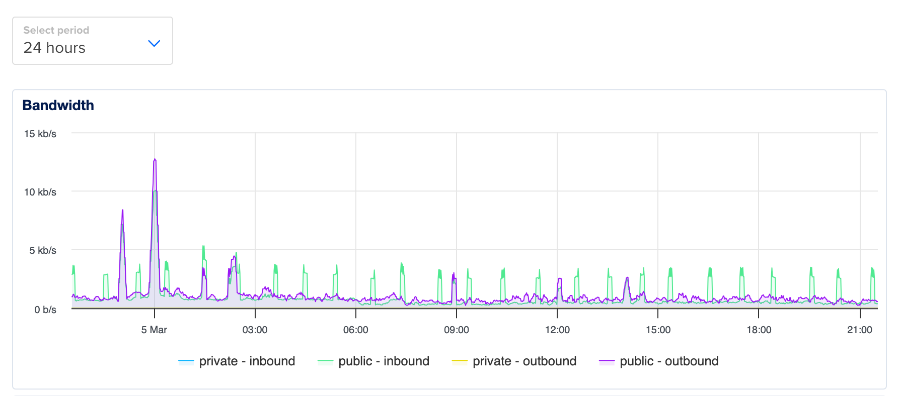

# CICF Week 8

The goal for this week's tutorial are:

- Familiarize yourself with a virtual machine running in a cloud
  environment.

We will:

- Log into a cloud virtual machine (VM) using `ssh`,
- Copy some files to the VM using `scp`,
- Run JupyterLab in the VM, access it over the internet, and
- Learn how to secure the VM.

## Tutorial

### Update your CICF repository clone

Start a terminal in the CICF VM running on your desktop, and run these
commands:

```
$ cd ~/cicf/week08-cloud-computing
$ git pull origin main
```

### Connect to your cloud VM

Each of you will get your own VM. The virtual machines are deployed
for you on Digital Ocean (DO), a cloud provider.  (DO calls VMs
"droplets".)

You can access your VM using [`ssh`][ssh], the OpenSSH remote login
client.  We will not use a password to log on to the VM, but rather,
we would use public key authentication.  (In fact, password
authentication with `ssh` is disabled on these VMs, because it is
considered insecure.  Remember that our little VM is out there on the
hostile territory of the public internet, and bad people can guess or
brute-force passwords.  Using public key cryptography is more secure.)

[ssh]: https://www.openssh.com/

```
$ ssh -o PasswordAuthentication=no -o PubkeyAuthentication=yes -i ~/.ssh/id_ed25519 cicf@YOUR-FIRST-NAME.cicf.cloud
```

Replace `YOUR-FIRST-NAME` with, well, your first name.  For reference,
these are the virtual machines:

* `aidan.cicf.cloud`
* `anshuraj.cicf.cloud`
* `baydan.cicf.cloud`
* `catherine.cicf.cloud`
* `dylan.cicf.cloud`
* `ejay.cicf.cloud`
* `elikem.cicf.cloud`
* `emma.cicf.cloud`
* `jasmine.cicf.cloud`
* `joanna.cicf.cloud`
* `macy.cicf.cloud`
* `naomi.cicf.cloud`
* `noe.cicf.cloud`
* `priscilla.cicf.cloud`
* `rishi.cicf.cloud`
* `spoorthi.cicf.cloud`
* `tamara.cicf.cloud`
* `xiuweb.cicf.cloud`

Since that `ssh` command is long and annoying to type every time we
need to use `ssh` (and its sibling `scp`, which we will use next), we
can save those `ssh` options in `~/.ssh/config`:

```
Host *.cicf.cloud
    User cicf
    PubkeyAuthentication yes
    PasswordAuthentication no
    IdentityFile ~/.ssh/id_ed25519     
```

With that configuration, you should be able to simply do `ssh
YOUR-FIRST-NAME.cicf.cloud`.

### Copy some files to your cloud VM

We have three files in [`data`](./data) directory:

- [`install-docker.sh`](./data/install-docker.sh), our old friend from
  week 5. We will use this script to install Docker on the VM.
- [`compose.yml`](./data/compose.yml), a Docker compose file that we
  will use to deploy JupyterLab and [Caddy], a [reverse proxy] server.
- [`Caddyfile`](./data/Caddyfile), which contains necessary
  configuration for Caddy.
- [`jupyter-caddy.service`](./data/jupyter-caddy.service), a "unit"
  file that we will use to run Jupyter and Caddy using Docker Compose
  as a background service.

 [Caddy]: https://caddyserver.com/
 [reverse proxy]: https://en.wikipedia.org/wiki/Reverse_proxy

 We will use [`scp`] to copy the `data` directory from your local VM
 to the cloud VM:

 ```
  $ scp -r data YOUR-FIRST-NAME.cicf.cloud:
 ```

Note that the above is a short-cut for the longer command below:

 ```
 $ scp -o PasswordAuthentication=no -o PubkeyAuthentication=yes -i ~/.ssh/id_ed25519  -r data cicf@YOUR-FIRST-NAME.cicf.cloud:/home/cicf/
 ```

We could save some typing since we have some configuration in
`~/.ssh/config`, and since the home directory is the default
destination when you invoke `scp`.


### Install Docker on the cloud VM

In the cloud VM, run

```
$ cd ~/data
$ ./install-docker.sh
```

Press `y` when prompted.

Once Docker has been installed, add yourself to `docker` group:

```
$ sudo usermod -a -G docker $USER
```

Log out of the VM using `Control-D`, `exit`, or `logout`, and log back
in with `ssh`:

```
$ ssh YOUR-FIRST-NAME.cicf.cloud
```

Make sure that you are now indeed in `docker` group:

```
$ groups
cicf sudo docker
```

### Run JupyterLab and Caddy with Docker Compose

Docker Compse is a tool for running applications running in more than
one container together.  You would run Docker Compose in the format
`docker compose COMMAND`.  Take a look at the output of `docker
compose help` to get an idea of what you can do.

You specify the applications you need to run with Compose and their
configuration in a file named `compose.yml` or `docker-compose.yml`.
Our `compose.yml` is in `~/data` directory:

```
$ cd data
```

We already have the configuration to run JupyterLab and Caddy in this
`compose.yml`.  It needs a change in one line.  Open the file in an
editor (`nano` perhaps) and find the line that says:

```
      - DOMAIN=YOUR-FIRST-NAME.cicf.cloud # Replace with your actual domain
```

Replace `YOUR-FIRST-NAME` with the right thing, so that domain is the
correct one.

Now we can run Docker Compse in detached mode (as in, not attached to
a terminal), with:

```
$ docker compose up -d
```

This will run JupyterLab and Caddy. JupyterLab will run on port 8888,
but we will not expose that port to the internet.  We will expose
ports 80 and 443 of Caddy to the internet.  Port 80 is for HTTP
(un-encrypted web traffic) and 443 is for HTTPS (encrypted web
traffic).  All port 80 traffic will be re-routed to
port 443.

For HTTPS to work correctly, Caddy will need a TLS certificate that
basically assert that the domain is what it claims it is, and provide
the information necessary for encryption and data integrity. 

Caddy can seamlessly get a TLS certificate from [Lets Encrypt][le], a
non-profit certificate authority.

[le]: https://letsencrypt.org/

Getting a TLS certificate used to be quite an involved process. You
had to pay for your certificates, and go through some manual processes
to prove your identity.  Lets Encrypt is a wonderful project that
removed this friction and made encrypted communication accessible to
everyone.

Anyway, end of speech.  We can now test things by visiting our new
site at `https://YOUR-FIRST-NAME.cicf.cloud` with a web browser.

Watch the logs that `docker compose` prints on the console when you
started things up and when you visited the site:

```
$ docker compose logs --follow
```

Use `Control-C` to stop following the log.

You can shut down things with:

```
$ docker compose down
```

### Install a service

The `docker compose` service you ran will quit when you log out of
your `ssh` session, because that is how processes work.  

To make things continue running even when you are logged out of the
cloud VM, we can install a [systemd] service.

[systemd]: https://systemd.io/

Copy `jupyter-caddy.service` to the correct location:

```
$ sudo cp jupyter-caddy.service /etc/systemd/system
```

Enable the service now:

```
$ sudo systemctl enable --now jupyter-caddy.service
```

We can check the status of the service using:

```
$ systemctl status jupyter-caddy.service
```

Or:

```
$ journalctl -xeu jupyter-caddy.service
```

We can make sure that things are running with:

```
$ docker compose ps
```

And follow the logs with

```
$ docker compose logs --follow
```

### Enable some firewall rules

Bad actors will keep trying to take over computers on the internet, so
that they can run botnets, bitcoin mining operations, spam networks,
or some such.  Since the internet can be a hostile place, we should
expose only the necessary network ports to the world.  

We could use the program [nmap] to run a quick scan against our VM:

[nmap]: https://nmap.org/

```
$ nmap sajith.cicf.cloud
Starting Nmap 7.93 ( https://nmap.org ) at 2025-03-02 21:20 CST
Nmap scan report for sajith.cicf.cloud (134.209.35.136)
Host is up (0.066s latency).
Other addresses for sajith.cicf.cloud (not scanned): 2604:a880:800:14::baf9:2000
Not shown: 991 closed tcp ports (conn-refused)
PORT     STATE    SERVICE
22/tcp   open     ssh
25/tcp   filtered smtp
80/tcp   open     http
111/tcp  filtered rpcbind
135/tcp  filtered msrpc
139/tcp  filtered netbios-ssn
443/tcp  open     https
445/tcp  filtered microsoft-ds
8888/tcp open     sun-answerbook
```

Those is a lot more open ports than necessary.  Some of them are
default services run by the operating system, but we do not want them
exposed to the internet.

We only want to expose the ports 22 (SSH), 80 (HTTP), and 443 (HTTPS).
The way to do this is by using a firewall.  We will use [ufw] (short
for "The Uncomplicated Firewall") to set up some firewall rules.

[ufw]: https://wiki.ubuntu.com/UncomplicatedFirewall

Install ufw:

```
$ sudo apt update
$ sudo apt install -y ufw
```

And now add the rules:

```
$ sudo ufw allow 22/tcp
$ sudo ufw allow 80/tcp
$ sudo ufw allow 443/tcp
$ sudo ufw default deny incoming
$ sudo ufw default allow outgoing
```

Now we need to "enable" `ufw`, so that the above rules take effect,
and `ufw` will run when you reboot the VM:

```
$ sudo ufw enable
```

Hit `y` when prompted.  If we run `nmap` scan again now, we should see
the desired output.

You can also check the status of the firewall with:

```
$ sudo ufw status verbose
```


### Monitoring the VM

Once your VM is online, you most certainly want to keep an eye on
it.  You want to know when something goes wrong, and you want to fix
whatever it is that has gone wrong.  You would use monitoring tools
for this.

In the basic case, we can use the cloud vendor's console to check on
some basic things such as network traffic, CPU usage, and disk I/O.
Here is a screenshot of a VM's network traffic graph as reported by
DigitalOcean console:



As we get more serious, we will want to monitor more things. Here is a
non-exhaustive list of things we could be monitoring:

- **System resources**, such as CPU, memory, disk, and network usage.
- **Server health and availability status**, such as
  uptime/availability, status of critical processes, hardware health.
- **Application and service performance status**, such as response
  time/latency, error rates, and throughput.
- **Storage and databases status**, such as database performance, and
  file system events.
- **Security status**, such as login attempts, firewall and network
  security, and system logs.
- **Network and connectivity status**, such as DNS resolution and
  availability of external service dependencies.
- **Application metrics**, such as app-specific performance metrics
  (example: order processing rate in an e-commerce site), and status
  of task queues.
- **Environmental factors**, such as power and server room conditions
  (temperature and humidity via sensors).

Here is a list of some popular server monitoring tools:

| Tool         | Type        | Best For                 |
|--------------|-------------|--------------------------|
| [Prometheus] | Open-source | Cloud-native, Kubernetes |
| [Nagios]     | Open-source | Traditional IT           |
| [Zabbix]     | Open-source | Enterprise networks      |
| [Datadog]    | Commercial  | Hybrid cloud, APM        |
| [New Relic]  | Commercial  | Full-stack observability |
| [Grafana]    | Open-source | Visualization            |
| [SolarWinds] | Commercial  | Enterprise apps          |
| [Icinga]     | Open-source | Flexible IT monitoring   |
| [Sensu]      | Open-source | Dynamic environments     |
| [PRTG]       | Commercial  | SMBs, all-in-one         |

[Prometheus]: https://prometheus.io/
[Nagios]: https://www.nagios.org/
[Zabbix]: https://www.zabbix.com
[Datadog]: https://www.datadoghq.com/
[New Relic]: https://newrelic.com/                                
[Grafana]: https://grafana.com/
[SolarWinds]: https://www.solarwinds.com/server-application-monitor
[Icinga]: https://icinga.com/
[Sensu]: https://sensu.io/
[PRTG]: https://www.paessler.com/prtg
 
We do have some pretty daunting lists!  When you need something more
advanced than the cloud vendor's monitoring tool, you can look at
these things.


### References

<!-- TODO -->

- [Docker Compose](https://docs.docker.com/compose/) documentation.
- [Caddyfile](https://caddyserver.com/docs/caddyfile) reference.

