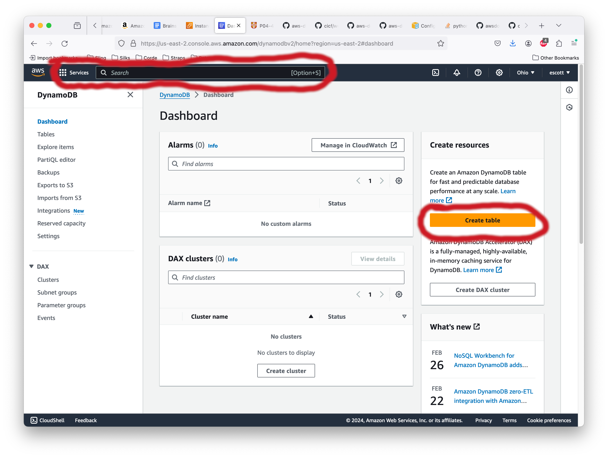
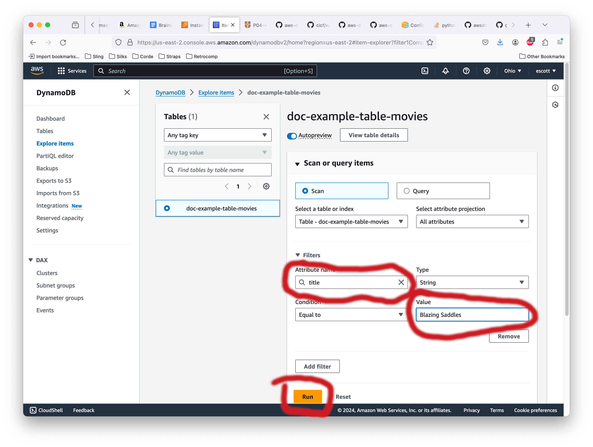
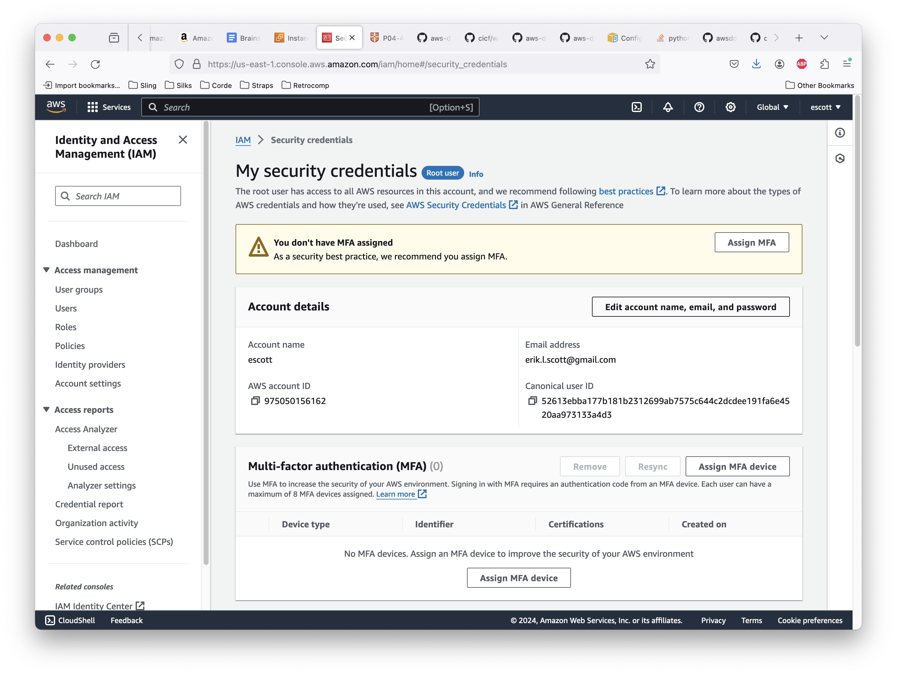
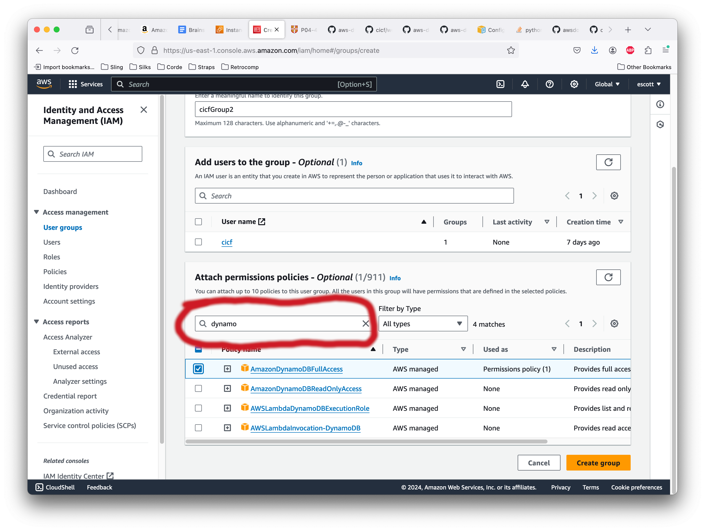
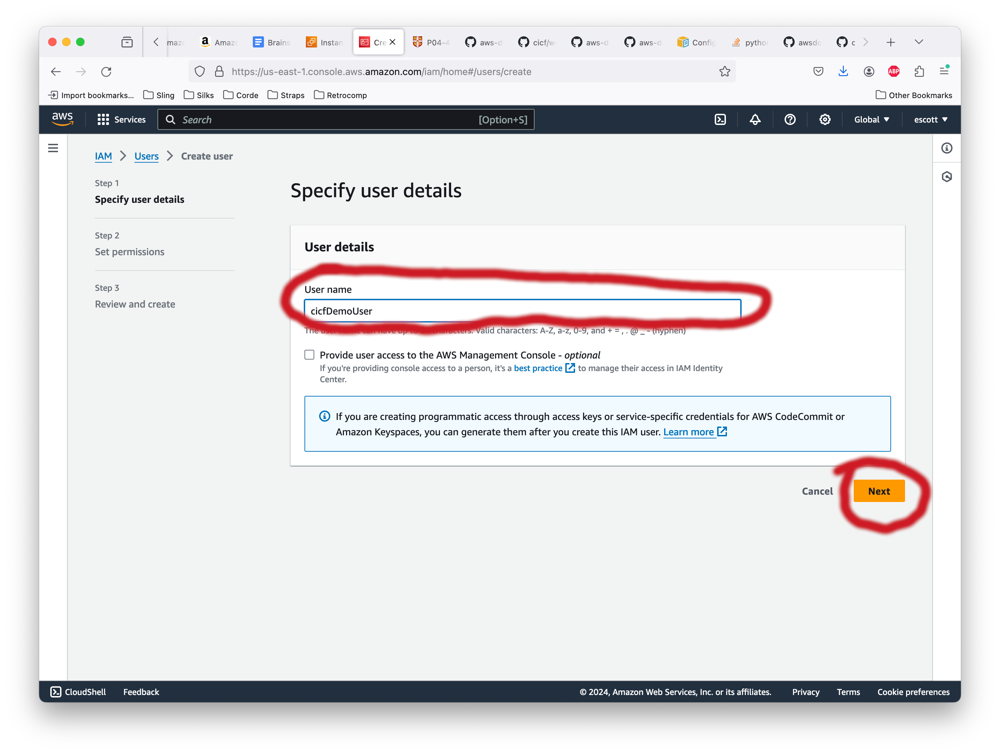
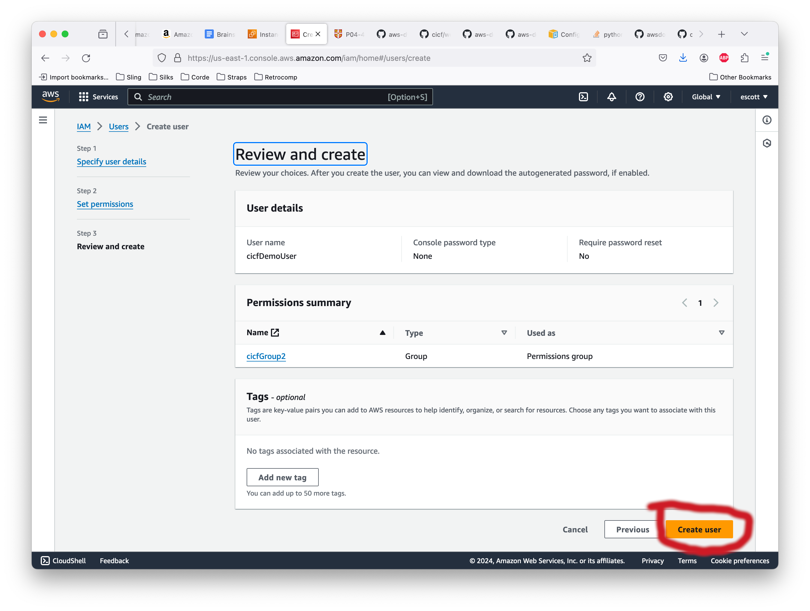
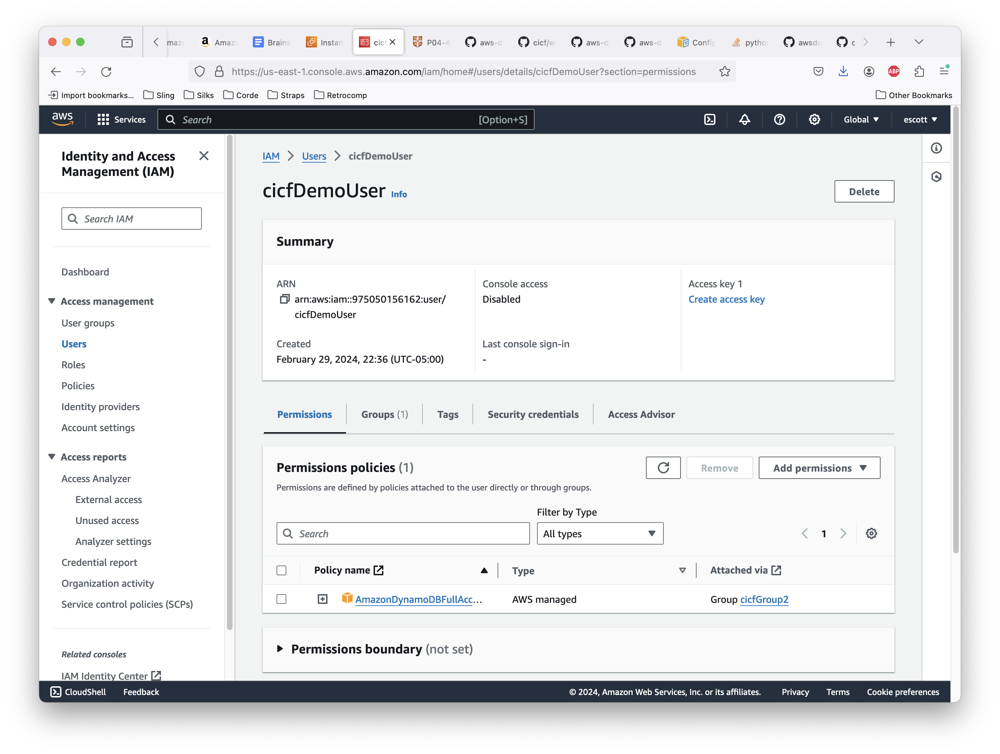
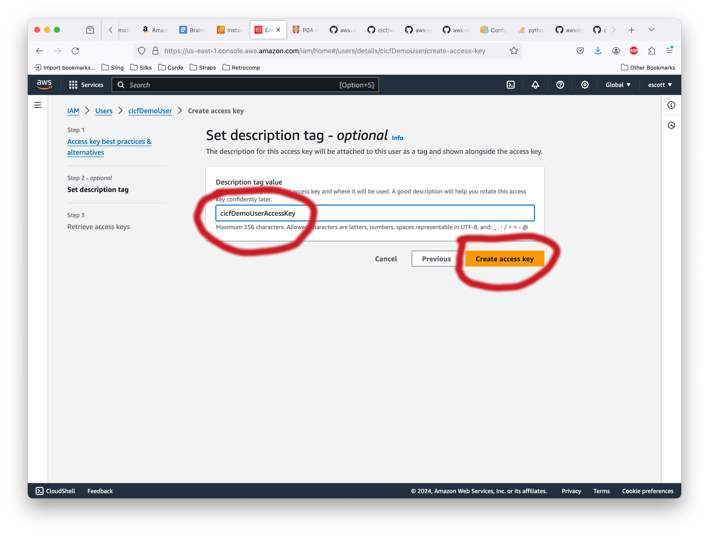
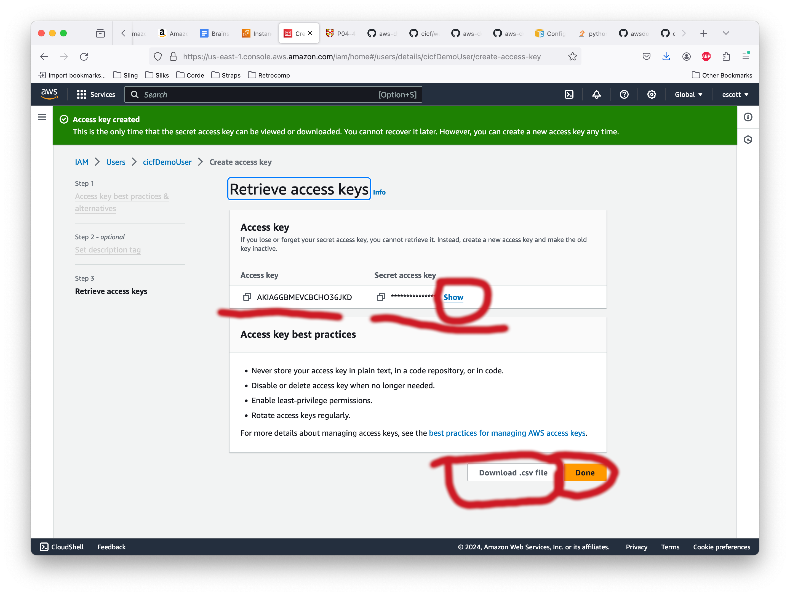

# Configuring Amazon's DynamoDB

You may choose to do this during the lab exercise today, or you might
just choose to watch me do it and use the instance I've created. I
recommend the latter because there are umpteen dozen steps to go
through and each one of them has to be right, but it's your call. If
you're working on this later and you get stuck, send me some email and
we'll get it sorted out.

With that said, let's get started. There are two basic steps to
accomplish: get Dynamo running andv go through the security
configuration so it can be used from programs and not just the
web-based management console.

## The actual DynamoDB config *per se*

The very first step is to go to the DynamoDB console page. From
anywhere in AWS's maze of console pages, you can enter a product to
search for or you can click on "Services" to pop up a dialog of
service consoles you've used lately.

Once you've searched for the DynamoDB product and gone to that page,
click on "Create Table" to get started.

You'll be prompted to enter the name for the table and you'll get to
specify the first of your columns. The "Partition key" field is
mandatory. This field is the one that is used, if need be, to split
your data among many, many servers. The other field is for a "sort
key". Partition key values don't have to be unique, but the
combination of a Partition key and a Sort key do have to be unique
across the entire table.

In our case, we've decided that name and age, together, have to be
unique for out little throwaway example.

Scroll down to the bottom of that page and hit the "Create Table"
button.

Clicking the "Create Table" button puts in a request to create the
table. The proces is usually very fast, taking just a handful of
seconds at the outside. You will be immediately taken to the "Tables"
view of the console, highlighted in blue on the left edge of the
browser. In the screenshot below, notice that "demoTable" is shown in
black and isn't a clickable, underlined blue thing yet. In a few
moments it will be. When it is, go ahead and click on it.

We should put some data in our new table, don't you think? Since we
clicked on "demoTable" a moment ago, we now have a view of that table
up. Click on the "Actions" button and select "Create Item".

Let's add "Alice", age 28. I find it much more convenient to view the
item as regular JSON instead of the extended syntax that Amazon
provides by default. Hit the switch to go to regular JSON and fill out
the template like so:

Click "Create Item" to actually make it happen, of course.

Now, do the same thing to add "bob", age 61.

Now, do the same thing to add "bob" again, also age 61.

Notice the error message at the bottom?

You can't have two items with the same partition key and sort
key. But, just because we can, let's insert Bob again, but this time
with his name properly capitalized. That will be enough to
differentiate him from "bob".

Go on and click "Explore items" in the left side list of views, make
sure demoTable is selected, and note the three items now stored in our
table.

We've had enough fun with our demoTable. Let's delete it. Click on
Tables in the left sidebar, check the box for "demoTable", and then
click the "Delete" button.

DunamoDB will make a heroic attempt to save you from shooting yourself
in the foot. In the text box at the bottom of the popup, you'll
actually have to type "confirm" before the "Delete" button becomes
active. When it does, click it.

This will take you back to the Tables view and there will be a message
indicating the deletion is in progress.

The "doc-example-table-movies" table is created and populated by a
demo program that Amazon wrote, I annotated, and we ran in lab. Let's
see what is in there. You can either click on "Explore items" in the
left sidebar, or you can select the table (by checking its checkbox)
and then selecting "Explore Items" from the "Actions" pulldown. Either
way is fine.

Once we're on the "Explore items" view, we can enter the field that we
want to search and the value that we're looking for. The "condition"
pulldown gives us even more options, but for now we don't need
them. Below the entry text boxes is the "run" button. Click it.

After it runs, the results will be visible below the Run button. Note
that "Blazing Saddles", one of the greatest movies of all time, is one
that I added by running the demo program.

At this point, you have a pretty good idea of how to get started with
DynamoDB. So far, though, we've only "used" the database by going
through the management console. This is useless for real-world use. If
only there was a way to manipulate Dynamo user program control...

And indeed there is (you saw it during the in-class lab activity,
remember?) Practically all of AWS's services can be manipulated
through a web-server-like control method called "web services". In
general, the interfaces are pretty easy to use. There's just one litle
catch: for security reasons, there has to be a way for the services to
know who the user is.  AWS does this by having an "Access Key" and a
"Secret Access Key".  Generating these keys is, sadly, rather
difficult the first time.

## Generating an AWS Access Key.

OK, to be fair, generating an access key isn't complicated exactly, it's
just that there are a lot of different ways to go about it depending
on how sophisticated your Identity and Access Management (IAM)
policies are. Given that there is precisely one of you and you don't
have any employees or contractors, it'll be OK to use the simplest
security model AWS will let us by with. After all, if you quit and go
work for LockBit, well, it's your account and credit card anyway. Go wild.

The first step is to go to the Security Credentials console for
AWS. This is done by clicking on your username in the upper right
corner of the window. The pulldown will have "Security credentials" as
the last item. (Yes, we saw this when we deleted a table in Dynamo
because, erm, uh, I accidentally clicked on the pulldown when I
accidentally clicked to take the screenshot. Embarassing. Anyway, here
it is again...)

When we click that, we'll land on the Security credentials
page. Here's what mine looks like:

From here, click on "User groups" over on the left side task bar. That
will bring up the page seen below. On this User groups screen, click
the big orange "Create group" button.

Now we're taken to the page for actually creating a new group. Up at
the top of the page, enter a name for our new group. If any users had
already been created (they haven't, so far) then we could go on and
add them.

Scrolling down some, we have the part where we can add permissions
policies. Here in the search blank, type "dynamo". That will narrow
the search down to four candidates. For our purposes today, select
"AmazonDynamoDBFullAccess". In normal production use, we would also
create a less privileged group with only ReadOnlyAccess and use that
as much of the time as we could get away with. It's always a good idea
to assign processes the least privilege.

Finally, scroll down a little more and click on "Create group".

Now that we have a group with Dynamo access, let's create a user and
assign it to that group. Click on "Users" in the sidebar and then
click on "Create user".

This will take us to the user creation page. Enter a name for the
user, then click "Next".

On the next screen, select "Add user to group" (the default, actually)
and select which group to add them to. Click "Next".

We're then taken to a summary of how the new user will be set up upon
creation. If we like all of it, we can click "Create user".

Now we've created a user and we're taken to the normal Users subpage
for that user. We see plenty of configuration settings for them.

Now we can _finally_ create that access key. Scroll down and look for
the "Create access key" button. Click it.

Amazon is (helpfully) going to ask us why we want to create an Access
key instead of using a temporary credential. We will select the reason
"Other" and it will let us create our key without having to confess
our sins or something.

Scroll on down and hit "Next".

It's optional, but it's a good idea to type a descriptive note about
what this key is for. Handy for when we go to clean up when we're
done.

Finally, at long last, Amazon sees fit to _actually create an access
key for us_. Yay! Indeed, it creates an access key pair (and we need
both of them to do anything. We can see the Access key: it's right
there on the screen. To see the Access Secret Key, we need to click
"Show".

Record this Access Key and Access Secret Key. We will not have another
chance to see these, ever. If we do lose them, we'll have to delete
this key and create a new pair from scratch. Not the end of the world,
but inconvenient.

To use this key, we just need to set a couple of environment variables
(`AWS_ACCESS_KEY` and `AWS_ACCESS_SECRET_KEY` to the values we saved. We
also need to set `AWS_DEFAULT_REGION` to whatever region we're using -
for our demo we've been using "us-east-2", aka "Ohio".

OK, now everything is set up to use Dynamo from a program. Have a
ball!
