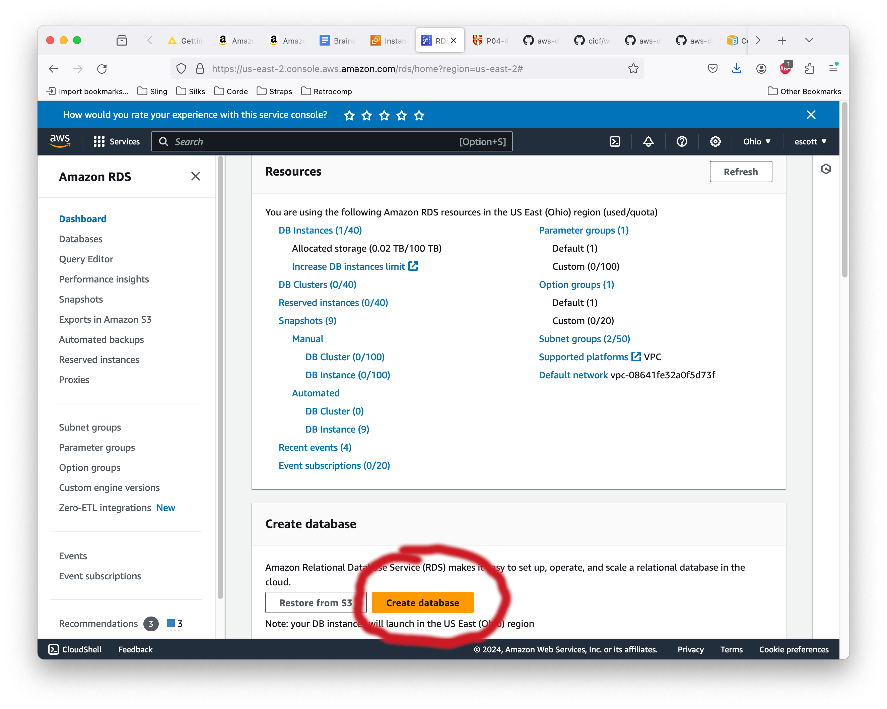
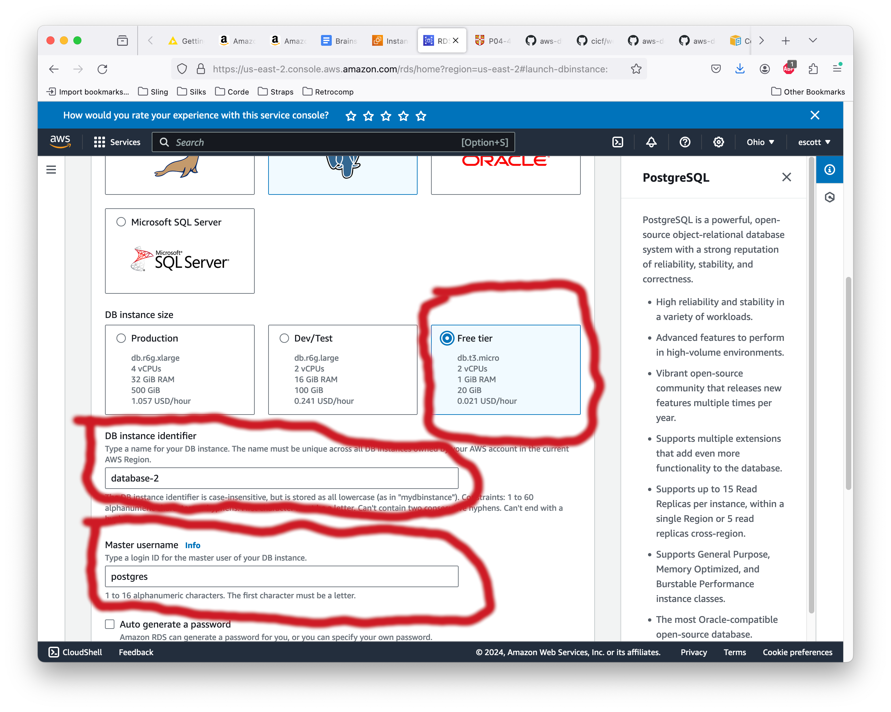
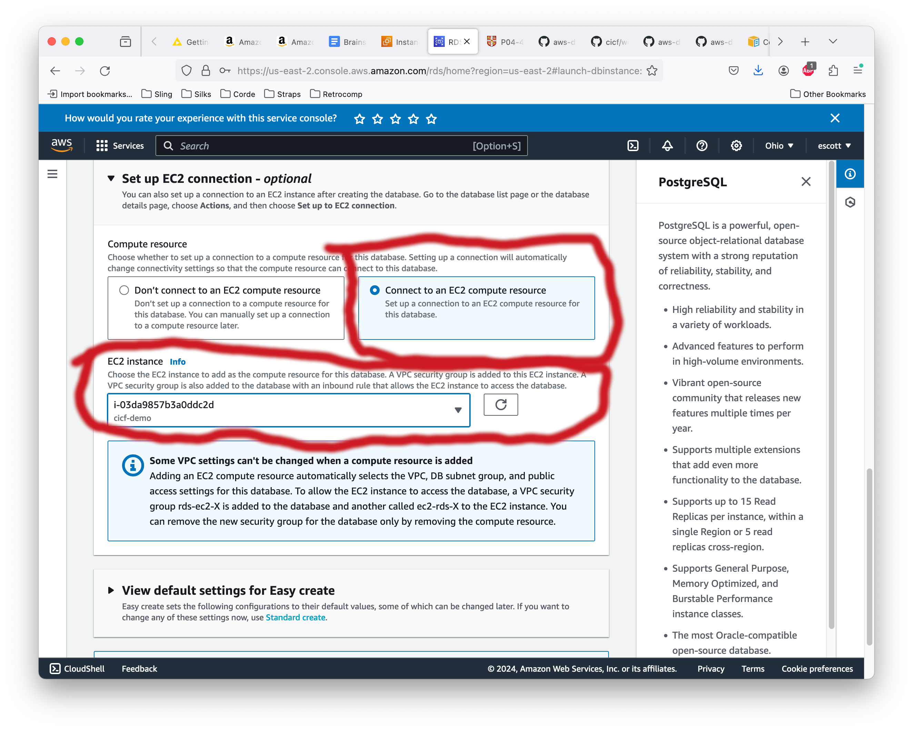
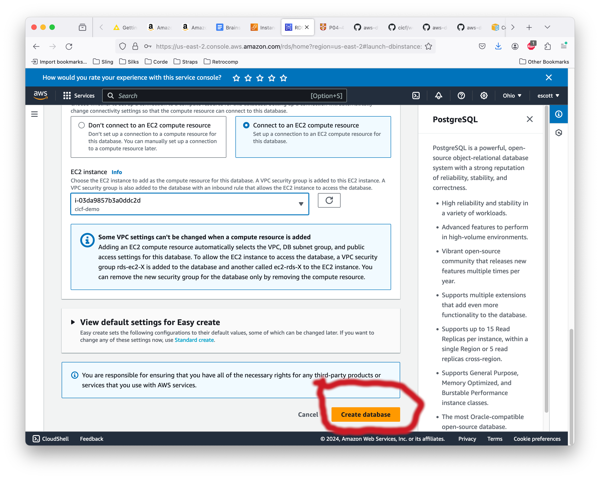
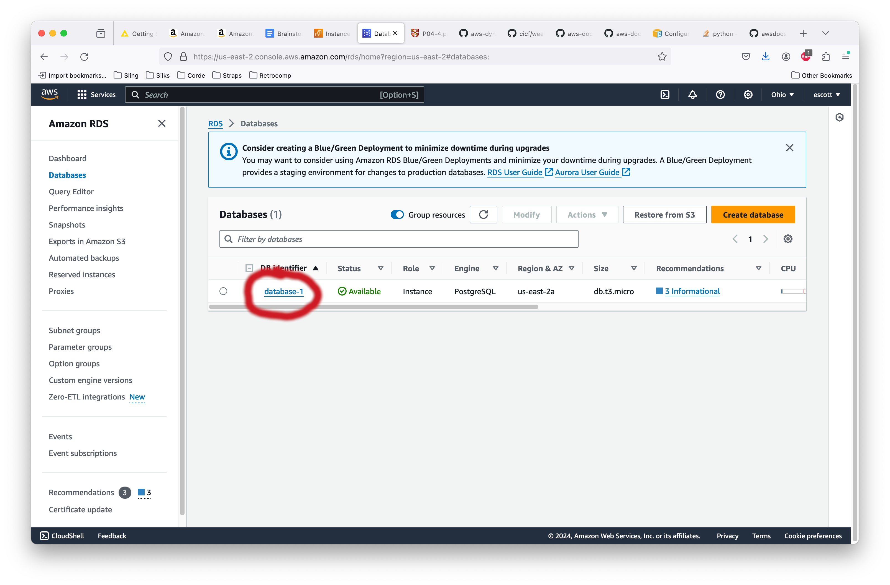
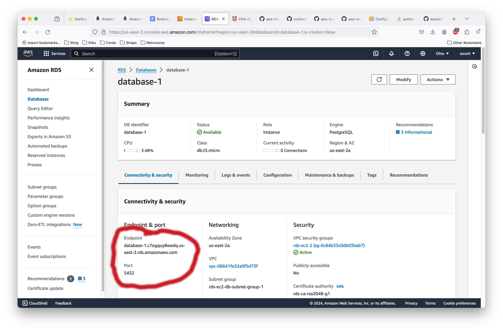

# Configuring Amazon's Relational Database Service - RDS

**You should not follow any of the steps in this document during class
on March 5th.**  The reason is that creating an RDS instance takes about
20 minutes, and that's AFTER you click "Create" at the end. I have no
idea why it's so slow, but once it's created it runs at the speed I
would normally expect.

The purpose of this file, and why it isn't incorporated into the
README.md, is so you can create an RDS instance for your own personal
education and enjoyment later.

With that said...

## Step 1: Open the RDS console.

Once you have logged in to AWS via aws.amazon.com, you will see a
console for all of the various AWS services. To find the specific
console for RDS, click in the search bar at the top of the screen and
enter "RDS". Note that if you've used it before, then RDS will be one
of the quick shortcuts in "Recently Visited".

Once you have the RDS console open, you can create a database
instance. Click on the "Create Database" button at the bottom of the
console:

The console will show the "Create database" actions. Click to select
"Easy create" and then below that select "Postgres".

 complete rights to do
anything on the database. This user is traditionally called the superuser.

Scroll down a little more, and you'll see two blanks to enter the
superuser's password. Fill them in, then click on "Set up EC2
connection".

In the Instance Connection part of the console, click the button
"Connect to an EC2 compute resource". In the "EC2 instance" blank, hit
the pulldown and select your compute instance.

It's OK, we're almost done.

Keep scrolling down... at the bottom of the console page is the
"Create database" button. Click it.

You'll come back to the initial console window. It may take
**forever** for your database instance to start up. You'll know the
instance is running when you see the number of running instances go
up. In this case, it'll go from 0 to 1. When it does, click where it
says "DB instances" and it will take you the management screen for
individual databases.

At the instance management page, you can click on "database-1" (or
whatever you named your database) to see some details about it.

Now you'll be on the detailed information page for your database
instance. Take particular note of the endpoint. This value is the
network name for your database. Note that, because it's what you'll
use to connect to your DB instance from your EC2 compute instance.

Congratulations!  You have your RDS instance with a running Postgres
server and now you can connect to it from your EC2 instance and run
SQL commands.

