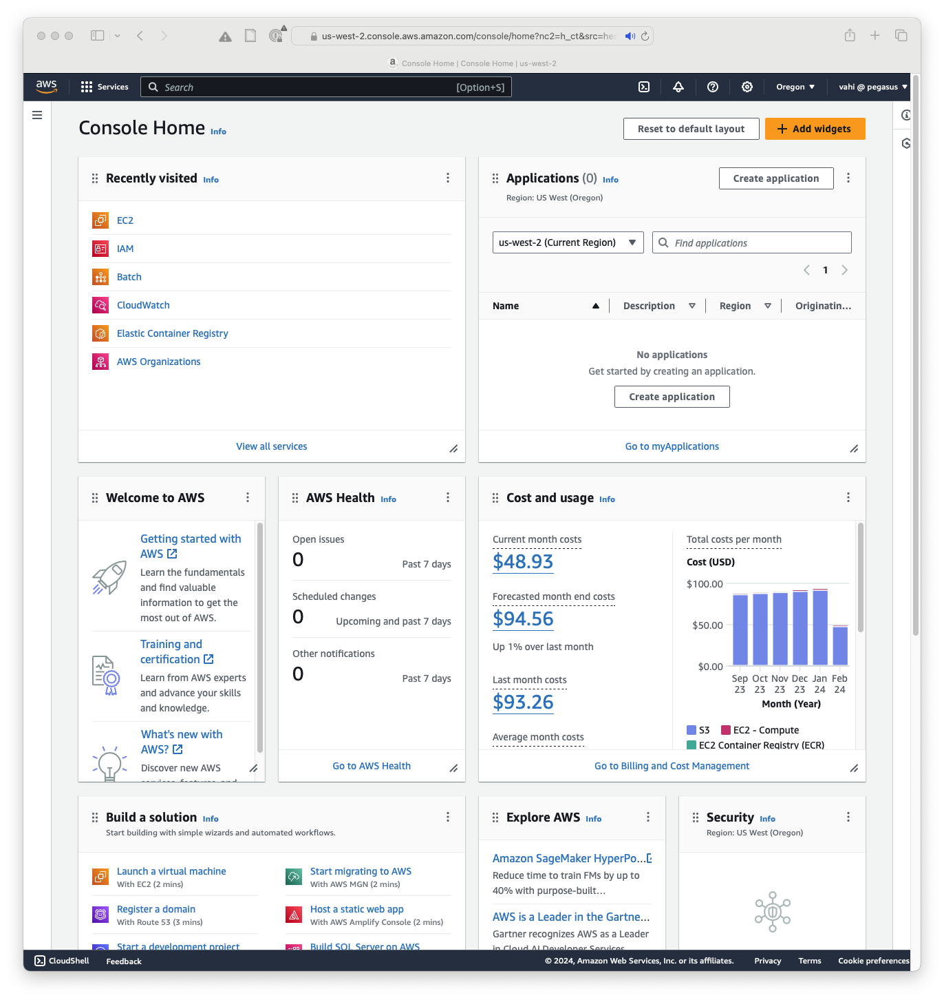
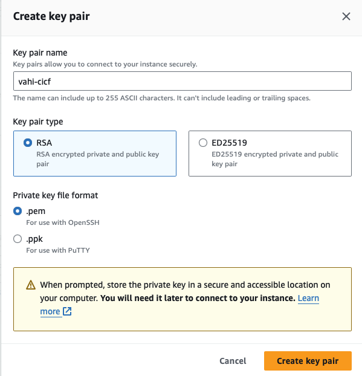
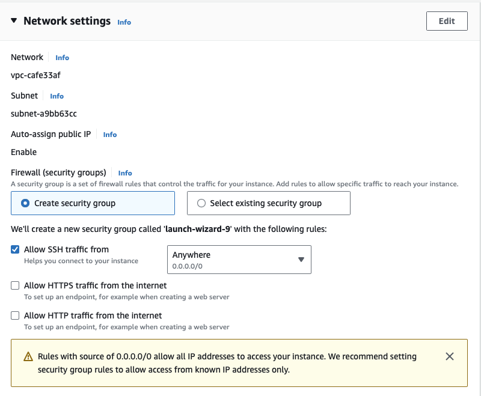

# Week 6: Intro to Cloud Computing

Bad news - the semester is half gone already. Where did the time go?  Anyway.


The first thing I did when we started this lab activity was that I started
up a Virtual Machine running in Amazon's "AWS" cloud. This VM is more or less
just like the ones we've been using on our laptops, except this new one
is *very* bare-bones. It doesn't even have a GUI installed - it's all command
line all the time. This is normal in the HPC world.

Remember how we've been hounding^Wreminding everyone "We need your public
keys!"? Today we're going to be using them. I could have started up the
instance (in the cloud world, a VM is called an "instance") with a completely
generic Linux installation and then gone in and configured everything.
Instead,, well, I did do that, a week ago, and I saved a snapshot of
the instance. Today when I went to start up our instance, I selected the
option to create the instance by using the snapshot I prepared beforehand.
Amazon calls those images "AMI"s, standing for Amazon Machine Instance.

I mention this because I went ahead a few days ago and I created user accounts
for each of you. I saved your public key with your account. That means you can
log in using your private key on your laptop's VM and it will match up with
the public key installed in that AMI. Let's do that now:
```
ssh Username@XXX.XXX.XXX.XXX
```
Obviously, don't literally put "Username" there, but instead put your
username created for this lab. In my case, I would use "escott". The
XXX.XXX.XXX.XXX part is the IP address of the instance we just created.
It's in the form of four numbers separated by periods. My command a few
days ago looked like "ssh escott@18.222.52.104", but I can guarantee you
the address will be different today.

# CICF Week 6: Intro to Cloud Computing

For the week6 lab, we will walk through the process of launching a 
virtual machine in the AWS cloud using EC2. It is recommended that you
create an account on the aws website, before coming for the lab. If you
already dont have an account, you can sign up for an account at

https://aws.amazon.com/free 

The goals for the week 6 lab are to:

1. Log into AWS Management Control
2. Configure launch options for EC2
3. Launch a Virtual Machine in EC2 Oregon Region
4. Connect to the running Virtual Machine via SSH

## Tutorial

This tutorial will walk you through on how to launch a virtual machine in 
the Amazon cloud using EC2.

### Creating an AWS account
It is recommended that you create an account on the AWS website, before 
coming for the lab. If you already dont have an account, you can sign up for
an account at

https://aws.amazon.com/free 

### Login to AWS Management Console

Login to the AWS Management Console by signing in with your username and
password, by clicking the orange button on the top right at this page

https://aws.amazon.com

Once you logon, you will see your AWS Management Console similar to the
image below



Once logged in, make sure you select Oregon as your AWS region.
To do this, you will see region (orange colored text) next to your
username on the top right of the page. Click on the region and select 
**US West (Oregon) us-west-2**

### Launch a virtual machine with EC2

Next, we will launch the EC2 console. To do this on your AWS 
Console page, look for **Build a Solution**. The first option there is
*Launch a virtual machine With EC2 (2 mins)* . Click on that. This will
bring you to the EC2 dashboard similar to the image below


There you would see an orange button in the middle of the page, that says
**Launch Instance**. Click on that. This will take you to the EC2
Launch an Instance Wizard. We will go through the main options for
us to launch the instance.

#### Name and Tags

Name and tags allows you to give a descriptive name for the Virtual Machine 
instance that you will be launching. In our case, we can name it 
`cicf-week6-instance`. 


#### Application and OS Images (Amazon Machine Image) 

Next we will select the Amazon Machine Image (AMI) to launch. The AMI
is a virtual machine image contains the software configuration (operating system
(OS), application server, and applications) required to launch your instance.

You will see an option to launch images of different types such as
* Amazon Linux
* Mac OS
* Windows
* Ubuntu etc

We will select Amazon Linux image that is also eligible for free tier.
In our case, we select **Amazon Linux 2023 AMI**.


#### Instance Type

Next we will select the instance type. Instance type dictates what type 
(how many cores, memory, cpu type, storage) of machine comes up. We will
opt for the smallest and free tier eligible one called **t2.micro**.


#### Key pair(login)

Next we will generate a key pair (ssh keypair) to be able to logon to the 
virtual machine once it starts in EC2. Since this is our first time, 
we will first create a keypair by clicking on **create new keypair**.


This will bring up the create key pair dialog box. We will opt for
the **pem** format, and name our key *username-cicf*.



The downloaded keypair, we will store in $HOME/.ec2 directory. 
In the terminal on your laptop, do the following

```
$ mkdir ~/.ec2
```

Then move the file into ~/.ec2 from your dowloads folder. Depending on your
OS you will run a command similar to below

```
$ mv ~/Downloads/<username>-cicf.pem ~/.ec2
```

Replace <username> with your username and ~/Downloads with path to 
the directory where you pem file was downloaded to.

Going back to the browser, make sure your keypair is selected.
For example 


#### Network Settings

Next, we will configure the network settings. The network settings essentially
allow you to define the network in which your virtual machine will be launched.
The most pertinent that you need to know of are

**Auto-assign public IP** whether you want a public IP addresses assigned to the
that starts up. In our case, since we want to be able `ssh` into the Virtual
Machine after it starts up, the answer is yes.

**Firewall (security groups)** A security group is a set of firewall rules 
that controls the traffic to and from your instance. Inbound rules control 
the incoming traffic to your instance, and outbound rules control the 
outgoing traffic from your instance. You can assign one or more security 
groups to your instance. In our case, we will create a security group and
click on the option *Allow SSH traffic from* and have it set to **Anywhere**.

The above means, that we can connect to this instance using ssh from
anywhere on the internet. In practise, for real world work this setting
is more locked down (i.e. restricted to a range of IPs)



#### Configure Storage

In the next step, you have an option of associating additonal volumes
(think of them as adding hard disks to your machine) to your virtual
machine instance. In our case we will not add any extra volumes, but
do with the root volume with the instance.

#### Advanced Details

We will skip this.

#### Summary and Launch Instance

The last section on the EC2 launch wizard is the summary page, where
you will see an orange button that asks you to launch the instance.


