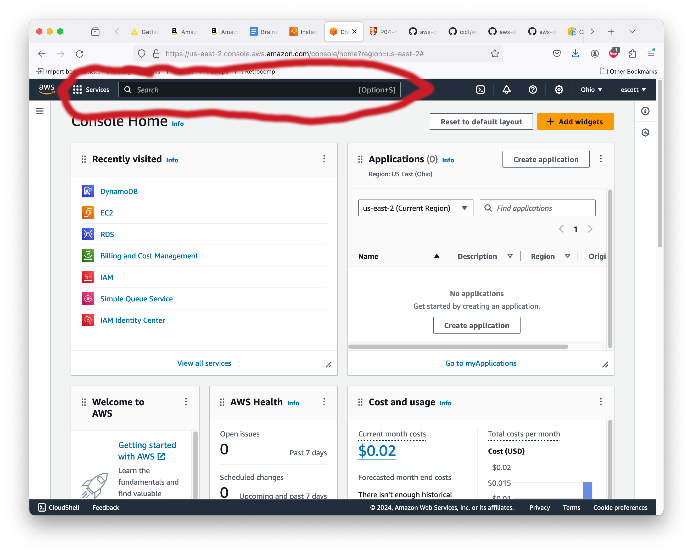

# Configuring Amazon's Relational Database Service - RDS

**You should not follow any of the steps in this document during class
on March 5th.**  The reason is that creating an RDS instance takes about
20 minutes, and that's AFTER you click "Create" at the end. I have no
idea why it's so slow, but once it's created it runs at the speed I
would normally expect.

The purpose of this file, and why it isn't incorporated into the
README.md, is so you can create an RDS instance for your own personal
education and enjoyment later.

With that said...

## Step 1: Open the RDS console.

Once you have logged in to AWS via aws.amazon.com, you will see a
console for all of the various AWS services. To find the specific
console for RDS, click in the search bar at the top of the screen and
enter "RDS". Note that if you've used it before, then RDS will be one
of the quick shortcuts in "Recently Visited".

